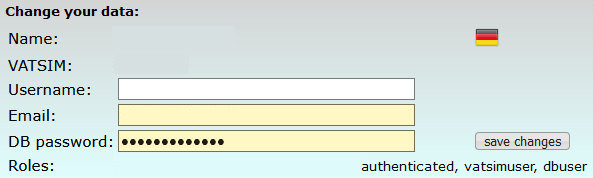

<!--
    SPDX-FileCopyrightText: Copyright (C) swift Project Community / Contributors
    SPDX-License-Identifier: GFDL-1.3-only
-->

## Registering with swift Datastore
In order to submit [Change Requests(CR)](./change_requests.md) for airlines, aircraft types and airline liveries you need to be registered with *swift* Datastore.

Please [join us on Discord](https://discord.gg/R7Atd9A) and request an account with one of our administrators.

**Suggestion**: after logging in to *swift* Datastore you can amend your account with your e-mail address and with a custom password for *swift* Datastore operations

* **Username:** keep the suggested name, it should be the same as your registered name at VATSIM
* **Email:** choose an e-mail address that you will always be able to access, as we will send password reset instructions and program notifications to this one
* **DB password:** the password that you define here can be used in *swift*GUI, *swift*DATA and on the website of *swift* Datastore to login to the Datastore.
