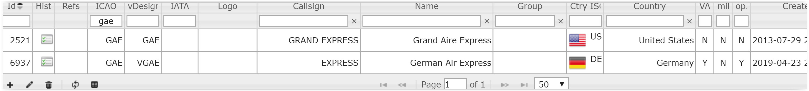
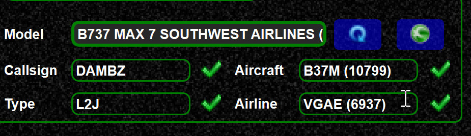

<!--
    SPDX-FileCopyrightText: Copyright (C) swift Project Community / Contributors
    SPDX-License-Identifier: GFDL-1.3-only
-->

The FSD protocol (which is used by VATSIM and other networks) transfers

-   your callsign
-   your aircraft ICAO designator
-   your airline ICAO designator
-   your model string (FsInn extension)
-   your livery string (not standardized for VATSIM, hence pretty useless)

Unlike in real aviation there or some challenges regarding airlines

-   there are VAs using the ICAO code of real airlines
-   people fly ceased airlines (not possible in real world)
-   people use wrong airline codes

All that can lead to ambiguous airline codes.
Also VATSIM only uses 3 letter ICAO codes.
So there is no chance to distinguish a virtual airline from a real airline.

*swift* however distinguishes VAs and real airlines.
In your database we use a 4 letter airline code for VAs, but this works only from *swift* to *swift*.

Example:

If you want to add your VA to the *swift* database you can do so, see [Change requests](./change_requests.md).
These airlines will be recognized by *swift* clients.
You can also add the airline name in the FP if you use other clients.

To create a mapping see [this article](./../swift_data/create_mapping.md).
