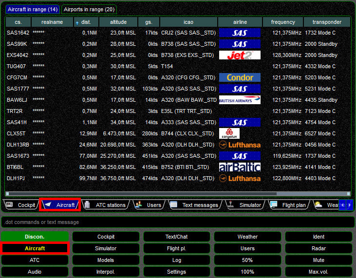
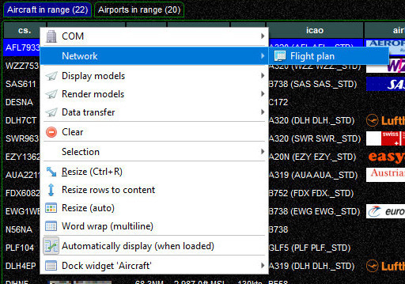
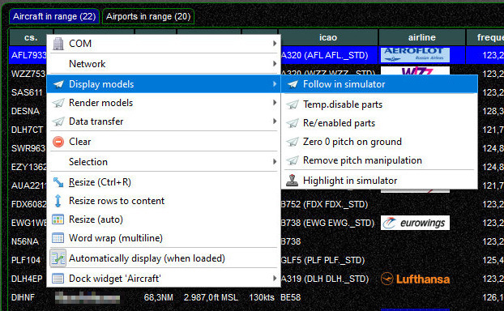
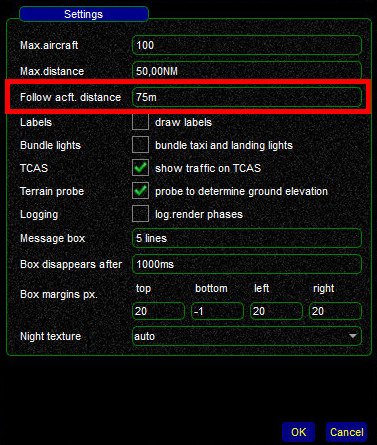

<!--
    SPDX-FileCopyrightText: Copyright (C) swift Project Community / Contributors
    SPDX-License-Identifier: GFDL-1.3-only
-->

The **Aircraft widget** will present you with a list of aircraft that are within your range.
You can adjust the range in ``Settings`` => ``Simulator``.

Each line will provide you with information about:

  * **callsign**
  * **name** of the pilot (**[anonymized](./../flying/incognito_mode.md)** in this screenshot)
  * **distance** relative to your own position
  * true **altitude** as broadcast by pilot clients
  * **groundspeed**
  * **ICAO aircraft and airline codes** of the model used by *swift* to display it
  * **airline logo**, if applicable and available in Datastore.
    If you want to have one added, **[follow these instructions](./../../home/getting_involved/airline_logos.md)**
  * **frequency** that is sent on a pilot's primary radio
  * **transponder** code and mode

By default the entire list is sorted by descending distance, aircraft that are closest to you will be listed on top.
You can change the sorting of the list column by column.

## Context Menu
To open the context menu in the Aircraft widget select any aircraft on that list and clicking on your right mouse button.
The context menu will offer you a number of functions and options.

## Flightplan

{: style="width:70%"}

## Follow Aircraft (X-Plane only)
Users of X-Plane can jump to an external view of any aircraft in the list.
After opening the context menu, select ``Display Models`` => ``Follow in simulator``\\

{: style="width:70%"}

You should now be seeing the select aircraft from the outside.

### Changing the viewing angle and distance

* **angle**: while keeping the space-bar pressed, **move your mouse**
* **distance**: while keeping the space-bar pressed, select either the **arrow-up** or **arrow-down** key

### Changing the DEFAULT follow distance

* in *swift*GUI select the **``Settings`` widget**, then choose **``Simulator``**
* clicking on **``[...]``** (at the right side of the X-Plane-line) will open the **X-Plane plugin settings** window
* **set a new value in ``Follow acft. distance``**.
  The unit is metres (similar to yards)
* changes will be saved through a prompt when you close *swift*GUI.

{: style="width:70%"}
