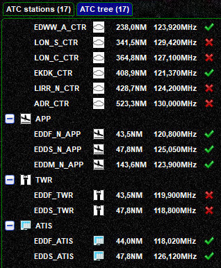

<!--
    SPDX-FileCopyrightText: Copyright (C) swift Project Community / Contributors
    SPDX-License-Identifier: GFDL-1.3-only
-->

This page of *swift*GUI will provide you with information about **Air Traffic Controllers** that are **active in the area where you are online**.

You can choose from 3 tabs:

* **ATC List**
* **ATC tree view** (categorized ATC stations)
* **VATBOOK data** (booked ATC stations).

## General List
The first tab will present you with a **general list of ATC stations** that is **sorted by distance** (ascending) between your own position and the primary centers of visibility of air traffic controllers.

### In Range
You can filter this list by ``in range`` stations (default setting).
The ``ATC stations`` **tab** displays the number of total and filtered stations (in the below screenshot "4 of 10").

{: style="width:70%"}

### All Stations
When you select ``all``, you will also see other stations that are **in your greater area**, but they may be outside of your communication range.

{: style="width:70%"}

## ATC Tree

The **ATC Tree** tab groups ATC stations into categories (ATIS, DEL, GND, TWR, APP, CTR, FSS).
This may be more convenient to some users as it improves the overview of who's online.

{: style="width:50%"}

## Controller and ATIS Information
By **clicking on** any of the list's **ATC and ATIS stations** you can retrieve the text information that they are providing.

{: style="width:50%"}

* the text will be shown in the **information box below the list**
* you can **adjust the vertical extent** of the information box by dragging the **blue divider up and down**

## METAR Information
It is possible to **request METAR information** by typing an ICAO code in the small field above the information box and then clicking on the ``METAR-button``

{: style="width:50%"}

## Context Menu
When selecting and right-clicking any station on any of these lists, you will be able to open a **Context Menu** with additional functions.

You can
* **tune ATC-frequencies** directly in your flight simulator
* **show the (public) text message tab** on the [Text/Chat page](./text_chat_page.md) of the selected ATC

{: style="width:50%"}

## ATC Bookings
*swift* downloads the **latest data from VATBOOK**, an international ATC booking database.
The list will provide you with ATC stations, dates and start and end times (Another nice way of checking VATBOOK and general VATSIM status data is using [Qutescoop](https://forums.vatsim.net/topic/28027-qutescoop-updated-airspace-and-airport-data-available/)).

{: style="width:50%"}
