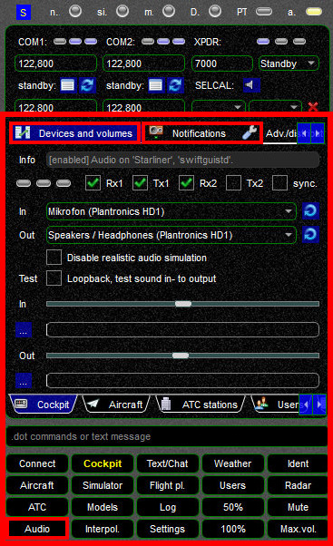
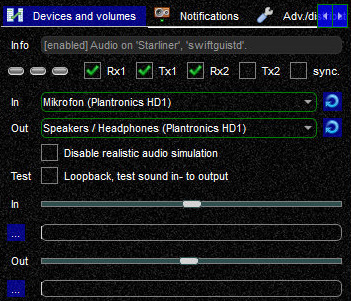
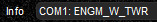
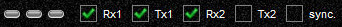
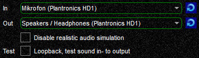
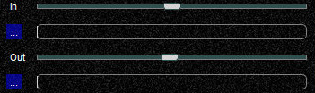
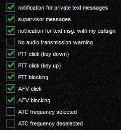
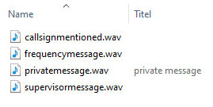
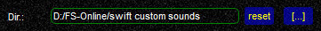

<!--
    SPDX-FileCopyrightText: Copyright (C) swift Project Community / Contributors
    SPDX-License-Identifier: GFDL-1.3-only
-->

The Audio and Cockpit widgets are sharing the same content.
In this chapter we will only be dealing with the **Audio** options that occupy the lower two thirds of this widget (large red frame in screenshot).

The Audio widget has 2 tabs that are relevant for us: ``Devices and volumes`` and ``Notifications``

{: style="width:50%"}

## Devices and Volumes
As the title says, in this tab you can configure your audio-devices and their volume.
But there are a few more functions to it that you should be aware of.

{: style="width:50%"}

### Info Field
On the top you will find the **Info field**.
As long as nobody is transmitting on any of the frequencies that you are tuned to, it will show the current status of your audio settings (enabled or disabled, what computer and what app it is running on).
You can disable the audio codec and have it run on a remote computer, see **[Distributed swift](./../distributed.md)**.

{: style="width:50%"}

As soon as somebody is transmitting on any of the frequencies that you are tuned to, **AFV (Audio For VATSIM) will display the station(s) that is/are currently transmitting**.
In the example below it is ENGM_W_TWR on COM1 who is shown as transmitting.
This function may become useful when somebody has a hot microphone (transmitting constantly by mistake) - everyone can clearly see what station is transmitting and a private message to the user in question can be sent to alert him to this situation.

{: style="width:50%"}

### COM Select
There are **three status LEDs** that are all OFF when you are not connected to VATSIM.
As soon as you connect to VATISM, *swift* will automatically try to authenticate you on Audio For VATSIM's dedicated server.
In case of success (=normal operations) the left-most LED will change to ON.
The other 2 LEDs monitor COM1 and COM2 and will only light up with activity on their associated COM-radios, similar to the **Info Field** above.

**Screenshot 1:**

  * the AFV status LED is OFF, *swift* is not connected to the AFV-server
  * the LEDs for COM1 and COM2 are OFF, nobody is transmitting

{: style="width:50%"}

**Screenshot 2:**

  * the AFV status LED is ON, *swift* has successfully authenticated and connected you with the AFV-server
  * the LEDs for COM1 and COM2 are OFF, nobody is currently transmitting

{: style="width:50%"}

This is an important item: *swift*GUI displays not only what radio is tuned to an active channel, but also what COM-radio is **configured to receive (Rx) and transmit (Tx)** radio transmissions, with the digit indicating the COM-radio.
Rx1 = receiving audio on COM1, Tx2 = transmitting audio on COM2.

You can **toggle the synchronization of your COM-radios:**

  * when **enabled**, *swift* will try to recognize the Rx and Tx configuration of the audio control panel in your flight simulator.
  This may not work for all aircraft models and flight simulator platforms, because of the way they have been coded.
  You can check for this on top of this page, **[more information here](./cockpit_page.md)**.
  If synchronizing does not work for an aircraft, then disable it
  * when it is **disabled**, you will have to **manually select the COM-radio** that you would like to transmit and/or receive on.
  This can be done by clicking on the respective boxes for Rx1, Tx1, Rx2 or Tx2.
  A green check-mark means that it is active.

Try enabling COM-syncing first, as it is more realistic to setup the radios in your aircraft.

### Audio Devices

This is straight forward:
  * **In**: select the microphone that you want to record your voice with
  * **Out**: select the device that you want the output of voice go to

{: style="width:50%"}

* **realistic audio simulation**: you can disable the artificial voice distortion, but this is not very realistic
* **voice loopback test**: please note that the loopback test will only work you are **not** connected to a network

### Audio Volume
The sliders control the input and output volumes and will help you to calibrate your microphone.
When talking, the volume bar should be bouncing into the green band.
If it does not, increase or decrease the microphone volume by using the input volume slider.

You can assign *swift* hotkey to increase and decrease the output volume, which may be useful on throttle quadrants or other hardware.

{: style="width:50%"}

## Notifications
In this paragraph we will discuss configuring and setting up notification sounds in *swift*.

{: style="width:50%"}

### Notification Sounds
To activate or disable a specific notification sound, just toggle the checkmark in the relevant box.
When activating a notification sound it will be played as a preview.

{: style="width:50%"}

### Sounds Volume
You can change the volume by entering a different value in this field.
The valid range is from 25 to 100.
By default a volume of 90 will be used.

{: style="width:50%"}

### Custom Sounds
You can replace *swift's* standard notification sounds with your own custom sound files.
When doing so, it is advisable to keep your custom files in a **completely separate directory** outside *swift* to avoid having them overwritten when you install a new version of *swift*.
Enter the path to this directory at the ``Dir.`` field on the "Notifications" page.
The separate directory does not have to contain all notification sound files, but only your custom files - *swift* will use its standard files for all other notifications.
You can test a sound by selecting the corresponding checkbox on the "Notifications" page.
The sound will then be played.

The filenames must match exactly:

- ``pttclick.wav`` (used for PTT click up **and** down)
- ``callsignmentioned.wav``
- ``unicommessage.wav``
- ``supervisormessage.wav``
- ``privatemessage.wav``
- ``frequencymessage.wav``
- ``logoff.wav``
- ``login.wav``
- ``error.wav``
- ``afv_click_f32.wav`` (requires restart on change)
- ``afv_crackle_f32.wav`` (requires restart on change)
- ``afv_hf_whiteNoise_f32.wav`` (requires restart on change)
- ``afv_whitenoise_f32.wav`` (requires restart on change)

In our example here, only a selection of custom sound files has been created and placed in a directory called "swift custom sounds", followed by defining it in this section.

{: style="width:50%"}

{: style="width:50%"}

