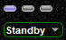
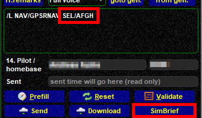

<!--
    SPDX-FileCopyrightText: Copyright (C) swift Project Community / Contributors
    SPDX-License-Identifier: GFDL-1.3-only
-->

The Cockpit and Audio widgets share the same content.
In this chapter we will only discuss the **Cockpit** options that occupy the upper third of this widget (red frame in screenshot).

{: style="width:50%"}

## COM Radios
By standard you should be able to tune COM 1 and 2 through the panel in your flight simulator platform.

* alternatively you can set active and standby frequencies directly in *swift*GUI
* the **blue double-arrow** is used to swap between active and standby frequencies
* by clicking on the white text window icon you will open a public text message dialogue for the frequency that is currently active

{: style="width:50%"}

## Voice Channel Status LEDs
Right above the COM radios you will find 3 LEDs for each radio.
They can be grey, blue or yellow.

* **the first LED** (from left) will light up (yellow) when you are connected to the voice channel of a controller or ATIS, otherwise it will be OFF (grey)
* **the second and third LEDs** show if the **transmit- and receive**-functions (respectively) are synched with the audio control panel of your flight simulator.
  A grey LED means that no audio functions for this radio are available, you have to power up your aircraft and its avionics and set the audio control panel to transmit and receive for this radio.
  If the LEDs are either blue (not synched) or yellow (synched), you can transmit/receive.

**Some examples:**

|||
|-|-|
|  | neither COM1 nor COM2 is tuned to an active frequency (both first LEDs are grey), but both can be used to transmit and receive voice, they are not synchronized with *swift* (both 2nd and 3rd LEDs are blue) |
|  | COM1 is tuned to an active frequency (first LED of COM1 is yellow), both COM1 and COM2 can be used to transmit and receive voice, but they are not synchronized with *swift* (both 2nd and 3rd LEDs are blue) |
|  | COM1 is tuned to an active frequency (first LED of COM1 is yellow) and is fully synchronized with *swift* (2nd and 3rd LEDs for COM1 are yellow). All LEDs for COM2 are grey, it is not connected to an active voice frequency and it cannot be used to transmit and receive voice |

## Transponder
The transponder function should be completely synchronized with your flight simulator platform.
Transponder codes and modes should therefore be set and controlled through the panel in your flight simulator.
If not, you can still modify all settings in *swift*GUI.

{: style="width:40%"}

### Transponder Code
Simply **type** a transponder code in *swift*GUI and it will be transferred to your aircraft's panel as well, if the connection between the two program works.

### Transponder Modes
There are three modes for your transponder: Standby, Mode C and Ident.
The **three LEDs** above it will light up accordingly and you can **control the modes by clicking on any of the LEDs**:

{: style="width:20%"}
{: style="width:20%"}
{: style="width:20%"}

Another way to change the transponder mode is by clicking on the mode field itself.
A drop-down menu will open and you can select your desired mode there:

{: style="width:20%"}

!!! danger

    You will not be able to change transponder mode through *swift*GUI if your aircraft's panel is recognized and keeps on overriding it.
    You will have to change mode through flight simulator

## SELCAL
SELCAL is short for [SELective CALling](https://www.skybrary.aero/index.php/Selective_Calling_System_(SELCAL)) and *swift* will alert you if an Air Traffic Controller transmits the SELCAL code that you have configured in your client.

{: style="width:20%"}

### Manual Setting
To setup a SELCAL code select the drop down lists of each pair of letters:

{: style="width:20%"}

### Automatic code parsing through simBrief
When you download a flightplan from [SimBrief](https://www.simbrief.com/home/) with a SELCAL code set in it, *swift* will recognize it automatically.

{: style="width:50%"}

### Valid vs Invalid SELCAL codes
It is important that you only **use valid codes**!
There are **2 rules** to creating them:

- letters **must not** be duplicated**
- SELCAL codes consist of two pairs of letters and the **letters of each pair** have to be in **ascending alphabetical order** (e.g. "AB-CF" is okay,"**BA**-CF" is not)

For more information check [Wikipedia](https://en.wikipedia.org/wiki/SELCAL) and [ASRI - How SELCAL works](https://www.asri.aero/selcal/how-selcal-works/)

|||
|-|-|
|  | This is an invalid code, because the letter "A" is duplicated, a **red X** is displayed at the end of the line |
|   | This is a valid code: no duplicated letters and both pairs of letters contain letters in ascending alphabetical order, indicated by a **green check mark** is displayed at the end of the line. |
