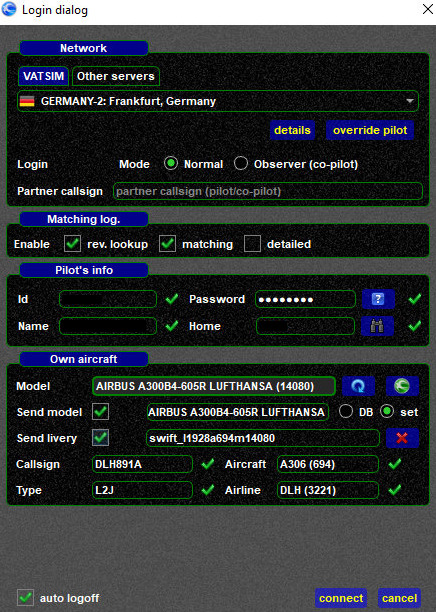
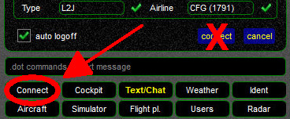
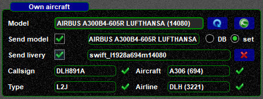

<!--
    SPDX-FileCopyrightText: Copyright (C) swift Project Community / Contributors
    SPDX-License-Identifier: GFDL-1.3-only
-->

There's an Advanced Login function available.

To open it, you need to **hold down** ``SHIFT`` while clicking on the **Connect widget** (don't mistake it for the Connect button on the Connect page).

On the Advanced Login Popup you can:

* set a **partner callsign** for flying in a **shared cockpit**: **[using swift in a shared cockpit](./../../flying/shared_cockpit.md)**

  

* **override livery and model string data** to appear as a different aircraft (e.g. as special livery of an airline)

  
