<!--
    SPDX-FileCopyrightText: Copyright (C) swift Project Community / Contributors
    SPDX-License-Identifier: GFDL-1.3-only
-->

# Connect Page

Before a connection to an online flight simulation network is made, several configuration parameters need to be set.
Most of them will already be pre-filled and do not need to be touched.
Only very few parameters need a one off configuration.
The following two sections explain how to connect to VATSIM or any other private FSD network.

Generally all changes you make are automatically saved and restored next time you launch the application.

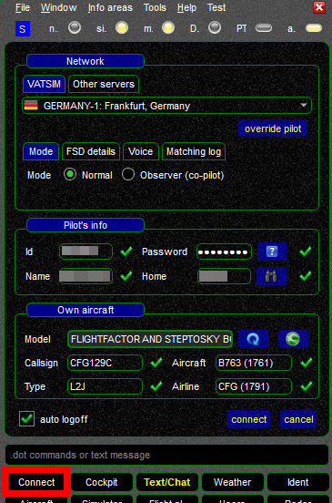{: style="width:50%"}

## Network Configuration
In this section you need to choose what network and server you want to use.

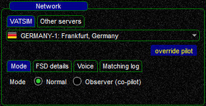{: style="width:50%"}

## VATSIM
To connect to VATSIM, select the ``VATSIM`` tab, a drop-down menu will present your with a list of active VATSIM servers.
The list is updated automatically on a regular basis.
Select the server of your choice, your selection is saved while connecting.

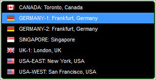{: style="width:50%"}

## Other Servers
In order to connect to a **custom FSD server**, change to the ``Other servers`` tab and select a server from the drop-down menu.
One typical scenario for such a custom server is connecting Euroscope to your flight simulator as **[Tower View](./../../flying/tower_view.md)**.
By default, *swift* does not offer any preconfigured custom FSD server.
Use the ``goto settings`` shortcut button (or go to ``Settings -> Servers``) to add and edit custom servers.

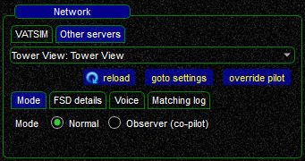{: style="width:50%"}

### Further Options

* **Mode Selection**: As a regular pilot, you want to use `Normal` connection mode.
  The second mode is offered for [shared cockpit users](./../../flying/shared_cockpit.md).
* **FSD Details**: The default values are fine for regular usage.
  See advanced section for more information.
* **Voice**: The default values are fine for regular usage.
  See advanced section for more information.
* **Matching log**: The default values are fine for regular usage.
  See advanced section and [this article](./../../../troubleshooting/model_matching/matching_log.md) for more information.

## Pilots Info
In this section you need to enter your network credentials.

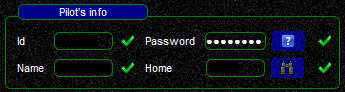{: style="width:50%"}

* **ID**: your VATSIM ID or for private FSD servers your custom ID
* **Password**: your network password
* **Name**: your registered name (see note below)
* **Home**: optional entry.
  The ICAO code of your home airport or of an airport near you.
  You can use the binoculars to help you find a valid ICAO code

!!! note

    According to [VATSIM's Code of Conduct](https://www.vatsim.net/documents/code-of-conduct) you may use your registered **first and last name**, your **first name** (including shortenings) or your **VATSIM ID**.

## Own aircraft
In this section you have to configure the data of the aircraft that you are using yourself to fly.
It is imperative that all **data is accurate**, otherwise the **other pilots** around you will **not** see you **displayed correctly**.

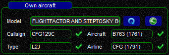{: style="width:50%"}

* **Model**: the model box will show you the aircraft that is currently loaded in your flight simulator.
  The frame of this box can have 3 different colours:

||||
|-|-|-|
| **RED** | 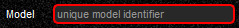 | *swift* could **not** read any information of your aircraft. Usually happens when *swift* is **not connected to your flight simulator**, check the status light  |
| **YELLOW** |  | *swift* was able to read the aircraft files, but could not find this combination of aircraft and livery in *swift* Datastore. Consequence: you can use the aircraft for your flights, but you have to **verify and correct all data-fields** (ICAO aircraft type, type of aircraft, airline livery code), takes more time and mistakes are more likely. **Consider adding the aircraft to the Datastore** with the help of the Quick Mapping Wizard, go to the **[Instant Mapping page](./../../flying/instant_mapping.md)** for all details, it's really easy! |
| **GREEN** | 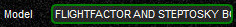 | *swift* read aircraft data from your flight simulator and found the combination of aircraft and livery in the Datastore. All data boxes will be pre-filled automatically, you just need to choose a callsign. Saves time and prevents mistakes |
| **Reload & Instant Mapping** |  | => the **blue circle-icon** allows you to **refresh** the **aircraft model information** from your flight simulator platform => the **green** *swift* **icon** will take you to the **[Quick Mapping Wizard](./../../flying/instant_mapping.md)** |

* {: style="width:20%"} **Callsign**: fill in a correctly formatted and realistic ATC callsign.
  If you are not sure about this, visit **[VATSIM's Learning Center](https://my.vatsim.net/learn/vatsim-basics/section/112)** to learn more about this topic (e.g. **AAL123** vs. <del>AA123</del> and **GOTMA** vs. <del>G-OTMA</del>).
* {: style="width:20%"} **Aircraft**: the **ICAO aircraft code** of the plane that you are using.
  ICAO aircraft codes are always made up of **4 letters and digits**.
  You need to insert a valid code, because this is the information that *swift* will be transmitting to the pilot clients of all other pilots in your area - incorrect codes will prevent your aircraft from being displayed accurately to other players!
  **ICAO** provides a **[list of valid codes](https://www.icao.int/publications/DOC8643/Pages/Search.aspx)**.
  *swift* will also assist you with this task:
  * **enter part of an aircraft ICAO code** and *swift* will display all DB-entries that match it:

  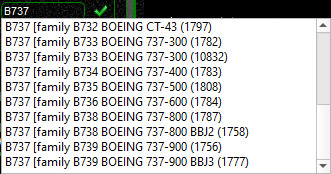{: style="width:50%"}

  * if you enter an **invalid code** the program will display a red X and **you won't be able to connect to the network**:

    {: style="width:20%"}

* 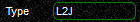{: style="width:20%"} **Type**: this field contains the **category of plane** you are using and **usually gets filled in automatically** when you choose a valid ICAO aircraft code.
  If not, you need to correct it.
  An aircraft category is always defined by **3 letters and digits**:
    * **FIRST**: L = land aircraft | S = seaplane | H = helicopter | G = glider
    * **SECOND**: number of engines
    * **THIRD**: type of engine => J = jet | P = piston | T = turboprop
* {: style="width:20%"} **Airline**: the **ICAO code of the airline** that you are using.
    * when you are flying a **general aviation aircraft** without any operator-affiliation, **leave the airline box empty**
    * **if you do not know** an ICAO code, then look for it on this **[Wikipedia List of Airline Codes](https://en.wikipedia.org/wiki/List_of_airline_codes)**
    * *swift* will only accept ICAO airline codes that are known to it, otherwise it will automatically clear the box

!!! tip

    You can open an **[Advanced Login Screen](./advanced_login.md)** to configure specific livery variants, although this will only work between users of *swift*.

## Advanced Settings, FSD Details
Different flight simulator networks offer various features and options.
Those can be enabled and disabled for this specific network.

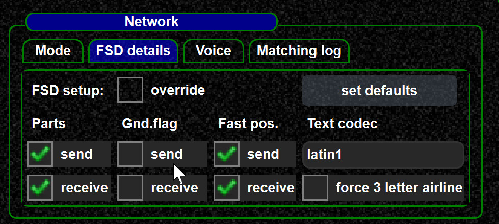{: style="width:50%"}

### Parts
Aircraft parts are a VATSIM specific extension of the FSD protocol to synchronize aircraft parts (gear, flaps, engines, lights, etc.).
Using the extension on other private FSD networks other than VATSIM might work.
Consult the network responsible in case of doubts.

### Gnd.Flag
This flag configures whether the ground flag is sent as part of a pilot position update.
On VATSIM, this is not the case.
IVAO and other FSD networks make use of it.

### Fast position updates
A flag that controls whether fast position updates are in use in this FSD network.
This generally works only between swift clients.

### Text codec
FSD protocol is pure ASCII.
Most FSD networks do not define which minimum string encoding is supported by the server and clients.
If another string encoding is required, it can be changed here.

### Matching log
The two check boxes enable or disable the creation of matching logs.
Those are helpful to understand why a particular remote aircraft is displayed.
The matching log is a very verbose trace of what information was available which decisions have been taken to select the visible aircraft model.
See [Matching Log/Messages](./../../../troubleshooting/model_matching/matching_log.md).
