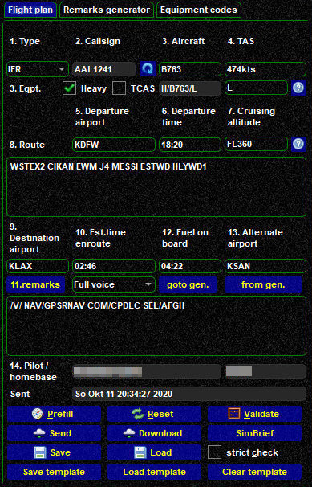
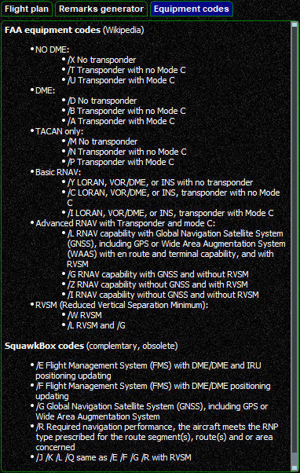
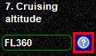
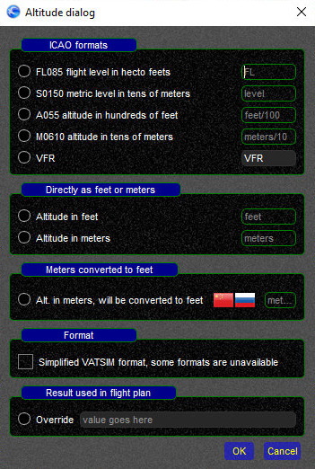
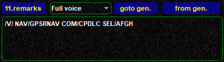
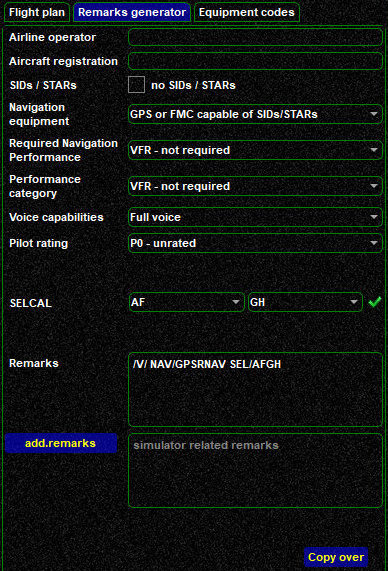
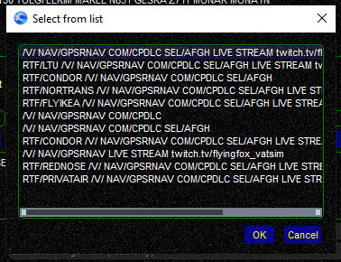
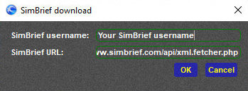

<!--
    SPDX-FileCopyrightText: Copyright (C) swift Project Community / Contributors
    SPDX-License-Identifier: GFDL-1.3-only
-->

The Flightplan page allows you to send flightplans to the network you are connected to.
Flightplans can be filled in manually, loaded from files and from the **[SimBrief Dispatch System](https://www.simbrief.com/)**.

{: style="width:50%"}

## Flightplan Data Fields
- **Type**: flight rules used. Currently *swift* supports:
  * VFR - Visual Flight Rules
  * IFR - Instrument Flight Rules
  * SVFR (Special VFR)
  * [DVFR](https://en.wikipedia.org/wiki/DVFR)
- **Callsign**: this field gets filled in automatically from what you have set as callsign on the **[Connect Page](./connect/index.md)**.
  Should the callsign shown on the flightplan not correspond to the one on the Connect Page, click on the blue circle icon to reload and override it.
- **Aircraft & Equipment**: this field gets filled in automatically from what you have set as callsign on the **[Connect Page](./connect/index.md)**.
  You can change it manually any time.
    * type code: needs to be a valid 4 letter aircraft type ICAO-code, check *swift*GUI's [Connect Page](./connect/index.md) for details
    * Heavy: if the MTOM (Maximum Takeoff Mass) of your aircraft is equal or greater than 300,000 lbs or 136 tons, set a check mark
    * TCAS: not really used any more
    * Equipment Code: VATSIM is currently transitioning from **[FAA codes](https://en.wikipedia.org/wiki/Equipment_codes#List_of_FAA_Aircraft_Equipment_Codes_For_US_Domestic_Flights[3])** to **[ICAO codes](https://en.wikipedia.org/wiki/Equipment_codes#List_of_ICAO_Codes_(As_of_15_November_2012)[2])** in this respect.
    *swift*'s flightplan form still uses and transmits FAA codes to the VATSIM flightplan interface.
    If you are not sure what to do here, click on the **question mark icon** {: style="width:20%"} and it will take you to the ``Equipment Codes`` tab:

    {: style="width:50%"}

    **Modern airliners will always be code L**

  - **TAS**: True Airspeed in knots (``kts``) or kilometres per hour (``km/h``)
  - **Departure Airport**: ICAO code of your departure airport.
    If no code is defined or if departing off-field, insert **ZZZZ** and specify **ADEP/** in the Remarks section, e.g. ``ADEP/Cairns Hospital``
  - **Departure Time**: time of departure in **Zulu/UTC format**
  - **Cruising altitude**: requested altitude or flightlevel for cruise.
    The most common formats are:
    * ``FLxxx`` (flightlevel in feet, ``FL`` in **capital** letters), e.g. ``FL360``
    * ``Axxx`` (altitude in hundreds of feet, ``A`` as **capital** letter), e.g. ``A045`` (4500ft)
    * click on the **question mark icon** to access a help-menu that will allow you to insert additional formats:

    {: style="width:25%"}

    {: style="width:50%"}

    **VFR:** when flying VFR, you may select ``VFR`` to not define a fixed altitude/flightlevel

    **China:** while the helper provides for flightlevels in meters for Chinese airspace, due to technical limitations of ATC radar clients, do **not** fill in cruising levels in metres, but use CVSM (Chinese RVSM)

  - **Route**: Fill in your requested flightplan route here
  - **Destination airport**: ICAO code of your destination airport.
    If no code is defined or if landing off-field, insert **ZZZZ** and specify **ADES/** in the Remarks section, e.g. ``ADES/Jonas Farm Strip``
  - **Estimated time enroute (EET)**: Enter your **calculated flying time** from takeoff to landing here, format ``hh:mm`` (hours and minutes), e.g. ``01:37`` for 1h 37min
  - **Remarks**: {: style="width:30%"}

    This field will hold all important and relevant information that does not fit into any of the other flight plan form boxes:

     * **your voice capabilities**: either **/V/** for for full voice receive and transmit, **/R/** when you can only receive voice transmissions, but have to reply by text and **/T/** if you can only receive and transmit by means of text.
     You can use the pulldown menu as well and *swift* will automatically change the designator in the remarks field.

     * navigation performance
     * SELCAL code
     * ADEP or ADEP in case you used ZZZZ in fields 5. or 9.
     * other relevant information
     * do not overfill this box with redundant information
     * *swift* can help you with its **Remarks Generator**.
      You can access it by either clicking on the ``Remarks generator`` tab or the ``goto gen`` button

      {: style="width:50%"}

       Just fill in/generate the remarks that you would like to insert into the Remarks Field.
       In the ``additional remarks`` field you can add your own custom remarks, e.g. your video stream address (do not use any colons ":", as they will cancel out everything after them).
       When you are done, click on ``copy over``

     * **Remarks Manager**: *swift* features a Remarks Manager.
     Whenever you file a flightplan, *swift* will memorize the content of the ``Remarks Field`` when closing the client.
     To access those memorized remarks, just click on the button ``11. remarks``

     {: style="width:50%"}

     Here, select the desired remark line and by clicking ``OK`` it will be pasted automatically

  - **Fuel on board (fuel endurance)**: Enter your **calculated fuel endurance**, format ``hh:mm`` (hours and minutes), e.g. ``03:12`` for 3h 12min
  - **Alternate airport**: ICAO code of your destination alternate airport.
  - **Pilot / homebase**: Your name or VATSIM ID and your homebase (optional) get copied over automatically from *swift's* **[Connect Page](./connect/index.md)**

At the bottom of the Flightplan page you will find a number of useful functions.

  * {: style="width:15%"} **submit your flightplan** to the network
  * {: style="width:15%"} will download **active or pre-filed flightplans** from VATSIM based on the callsign you are logged in with.
    Works only while you are connected to VATSIM
  * {: style="width:15%"} **after creating a flightplan in SimBrief**, you can click on this button to fetch all the data directly from their server.
    A window will pop up, fill in your **SimBrief username**, click on ``OK``.
    Note: SimBrief only allows you to download the last flightplan that you have created

    {: style="width:50%"}

  * {: style="width:25%"} you may save and load flightplan data. Acceptable formats are vPilot, SB4 and *swift* JSON.
  * {: style="width:15%"} before submitting a flightplan you can allow *swift* to validate your flightplan data.
    This can be done either in a strict or in a lenient way.
    Use the check mark box to control the mode.
    If any field does not contain valid data, the validator will inform you about this fact so you can correct it and run the validator again
  * **Prefill** fills the flight plan based on current aircraft data
  * **Reset** allows you to clear the entire flight plan to start over
