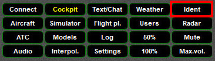

<!--
    SPDX-FileCopyrightText: Copyright (C) swift Project Community / Contributors
    SPDX-License-Identifier: GFDL-1.3-only
-->

When selecting this Widget, *swift*'s ATC-transponder will send an **IDENT**-signal to VATSIM.
You will be able to observe the transponder status change to  for a couple of seconds, before reverting to its previous setting again.

{: style="width:50%"}

More information can be found on the page describing the **[Status Bar](./status_bar.md)**.
