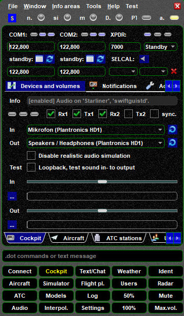

<!--
    SPDX-FileCopyrightText: Copyright (C) swift Project Community / Contributors
    SPDX-License-Identifier: GFDL-1.3-only
-->

# swiftGUI

As a standard user you will mainly be utilizing the standalone version of ***swift*GUI**.
Every now and then you will be using ***swift*Data** (Mapping Tool) to create or recreate the aircraft model set that *swift*GUI will use to display the planes of other pilots around you, when your are online.

*swift*GUI has a lot of functions and options and we will show you your way around.

{: style="width:50%"}

## All features explained

* **[Status Bar](./status_bar.md)**
* **[Connect Page](./connect/index.md)**

## Video Tutorials

We provide you with a number of [Tutorial Videos](./../../home/video_tutorials.md) to help you getting started.
