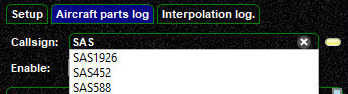
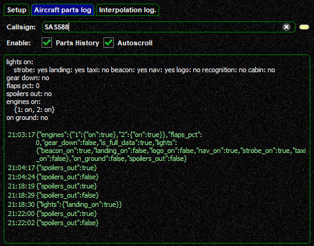

<!--
    SPDX-FileCopyrightText: Copyright (C) swift Project Community / Contributors
    SPDX-License-Identifier: GFDL-1.3-only
-->

The Interpolation page is more like a debugging page for testing and troubleshooting.
It allows you to **monitor and log aircraft data** that is transmitted by other clients in your range.
This includes the **status of engines, moving parts and lights** and the altitude/elevation of models.
If you observe aircraft models that exhibit unexpected behaviour in terms of aircraft parts and lights, you can see what *swift* is receiving.

You can only log parts of aircraft that are in range, as listed on the [Aircraft](./aircraft_page.md) and [Models](./models/index.md) Pages.

Proceed to the ``Aircraft parts log`` tab and type the callsign of the concerned flight.
Partial callsigns will result in a drop-down list, in case that there is more than one match to it.

{: style="width:50%"}

The log will be shown in the box

* **text in white** indicates the status of items at the time of requesting the log
* **text in green** displays all changes to parts after the interpolation log was intialized

{: style="width:60%"}
