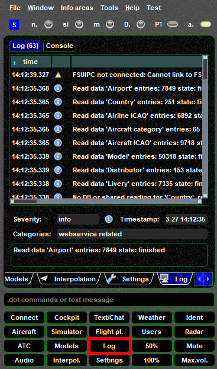
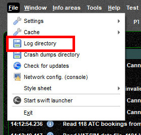

<!--
    SPDX-FileCopyrightText: Copyright (C) swift Project Community / Contributors
    SPDX-License-Identifier: GFDL-1.3-only
-->

The Log page allows you to review all log messages of *swift*.

{: style="width:50%"}

## Log Files and Log Directory

Each time *swift*GUI is shut down, log files will be written in a dedicated directory.
The standard file log file will be named ``swiftguistd_yymmddhhmmss_number`` (yy: year, mm: month, dd: day, hh: hour, mm: minute, ss: second, number: some log number), where the time stamp is when *swift*GUI was closed and the log-file was written.

If a log file is requested for review, you can easily access the path by opening *swift*GUI's ``File`` menu and then select ``Log directory``.

{: style="width:50%"}

In there, search for the appropriate file of the session that is to be sent and checked.

!!! note

    If your computer crashed without being able to close *swift*GUI properly, no log file may be written.
