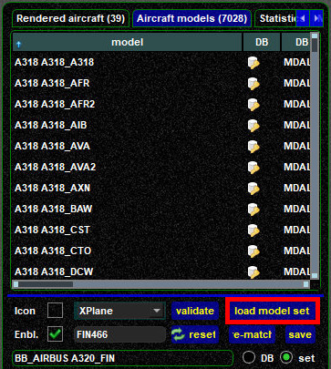

<!--
    SPDX-FileCopyrightText: Copyright (C) swift Project Community / Contributors
    SPDX-License-Identifier: GFDL-1.3-only
-->

# Models Page

The **Model Page** is the big brother of *swift*GUI's [Aircraft page](./../aircraft_page.md), it features 4 tabs:

* Rendered aircraft
* Aircraft models
* Statistics
* Matching log

{: style="width:50%"}

## Rendered Aircraft
This tab lists all aircraft that are within your range and features more columns with data than the [Aircraft Page](./../aircraft_page.md).
You either need to scroll to the right or increase the size of *swift*GUI to see all data.
By default the list is sorted by distance in ascending order, aircraft that are closest to you will be listed on top.
You can change the sorting for any other column.

* **e. = enabled**: a **green checkmark** means that an aircraft is enabled, this is default for all models.
  If you choose to disable a model for this session, a **red X** will be displayed and the model will not be rendered in your flight simulator.
  A good use-case would be a pilot who displays disruptive behaviour and flight manoeuvrers: disable the aircraft of such a pilot to hide it
    * to disable or enable a model, select the aircraft from the list and open the context-menu (right mouse button).
    Then choose ``Render Models`` => ``Disable aircraft`` or ``Enable aircraft``

    {: style="width:70%"}

* **r. = rendered**: a **green checkmark** indicates that *swift* is allowed to draw an aircraft in your flight simulator.
  Unrendered models are marked by a **red X**
* **callsign**
* **distance** relative to your own position
* true **altitude** as broadcast by pilot clients
* **CG = center of gravity**: this is what *swift* refers to as the height correction of a model.
  By default the value is 0,0ft, but some models require so-called "vertical offsets" to stop them from being rendered below the ground
* **p. = parts**: if moveable aircraft parts (landing gear, flaps etc.) are enabled, a green checkmark is displayed
* **fp. = fast position updates**: so far, not relevant for flights on VATSIM
* **gnd = ground flag**: a red X indicates that a model is able to send "ground flag", not relevant to VATSIM
* **groundspeed**
* **name** of the pilot (**[anonymized](./../../flying/incognito_mode.md)** in this screenshot)
* **icao = ICAO aircraft and airline code/livery**: *swift's* matching results for this aircraft
* **model**: the name of the CSL/AI model that *swift* is using to display the data of the previous ``icao``-field
* **type**: either
    * ``matching``: automatically detected and calculated match, or
    * ``manually set``: user has manually chosen and saved a model for this aircraft

* **desc. = description** of the CSL/AI model file type used
* **aircraft**: matching result for aircraft type of the other pilot, either
    * ``[==]``: if CSL/AI model of same type found, or
    * ``->``: to indicate what aircraft type was sent by the client of the other pilot and what type will be used instead, if type was not found in own CSL/AI model database (e.g. {: style="width:10%"})
* **livery**: matching result for livery of the other pilot, either
    * ``[==]``: if a matching livery was found, or
    * ``->``: to indicate what airline livery will be used instead, if livery was not found in own CSL/AI model database

## Aircraft Models
The list in this tab displays your **Active Model Set** and will be empty when you open it for the first time in a session of *swift*GUI.
To populate it, click on the button ``load model set``.
This tab will be useful when you want to **[manually change a model](./manually_changing_models.md)**.

{: style="width:50%"}

## Statistics
You probably won't have any use for this, but you can create statistics for the models used.

## Matching Log
The Matching Log allows you to review *swift's* matching-logic for a specific aircraft.

To display a matching log, you'll first have to enter the callsign of an aircraft from your Rendered aircraft list.
If you insert a partial callsign and there are several aircraft in range that match it, a drop-down list will present them.

{: style="width:50%"}

In this example ``DLH1996`` was selected and confirmed by pressing the ``ENTER/RETURN`` key.

{: style="width:50%"}

You can now review all details that the pilot client of this user is transmitting to all other clients in range and how *swift's* matching logic is handling it.
Quite often a "wrong aircraft match" turns out to be incorrect data that is transmitted.
Wrong input leads to wrong output.

!!! tip

    If you do not like a matching result, you can **[manually change the model assignment](./manually_changing_models.md)**.
