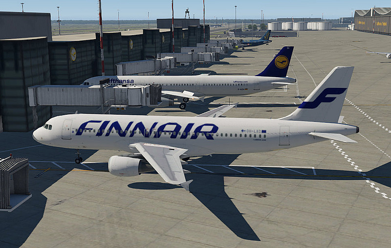
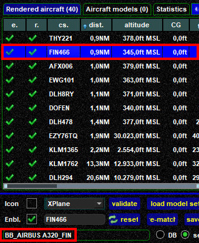
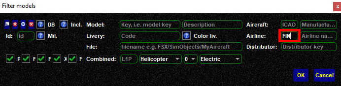
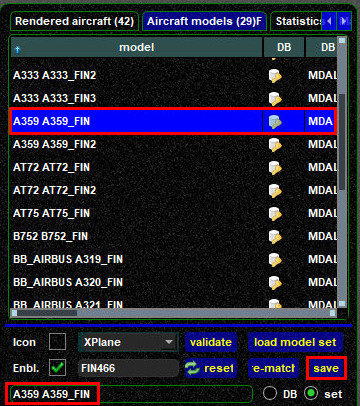
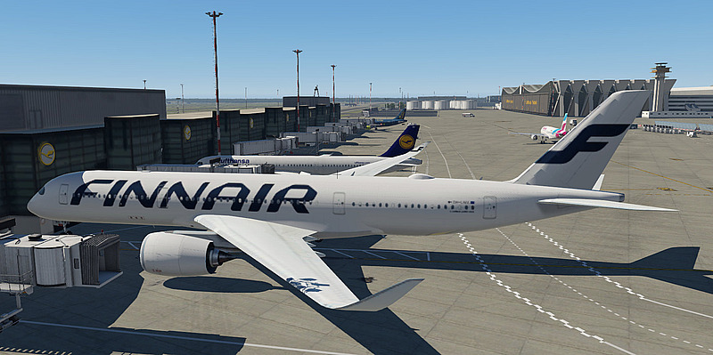

<!--
    SPDX-FileCopyrightText: Copyright (C) swift Project Community / Contributors
    SPDX-License-Identifier: GFDL-1.3-only
-->

You can replace any rendered aircraft model with another one from your **Active Model Set**.
Such a change will be valid for one online session only, the modification won't be saved permanently.

The below example illustrates how it's done:

  - you observe this Finnair Airbus A320, but you would like to replace it by another Finnair aircraft

    {: style="width:70%"}

  - to start the process, locate this aircraft in the Rendered aircraft tab.
    When you select it in the list, you can verify the model name that is used to render it at this time, in our example **BB_Airbus A320_FIN**.
    You could now modify this model name, but there is a more comfortable way, see next list item

    {: style="width:50%"}

  - proceed to the **Aircraft models tab** and select ``load model set``, then open the filter-dialogue with ``CTRL-F``.
    Filter the list according to what you are looking for, in our case we will search for all aircraft with airline ICAO code "FIN":

    {: style="width:70%"}

  - the list of aircraft will show only aircraft that are marked as FIN/Finnair.
    In this example a Finnair Airbus A350-900 is chosen as replacment.
    The process is only complete after selecting ``save``

    {: style="width:50%"}

  - as you can see, manually changing the model has worked as expected

    {: style="width:70%"}

To reset a modification you simply have to select the concerned aircraft from the rendered aircraft list and then click on ``reset``.
