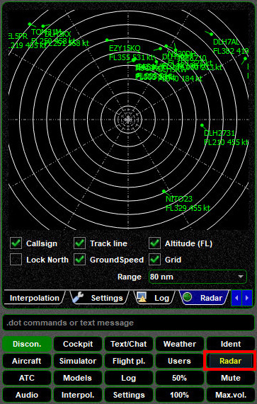
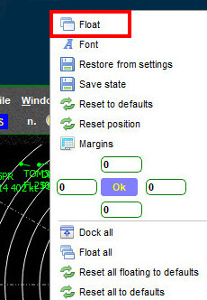
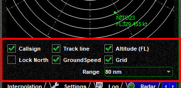
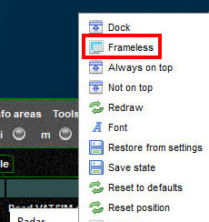
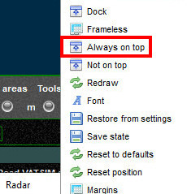
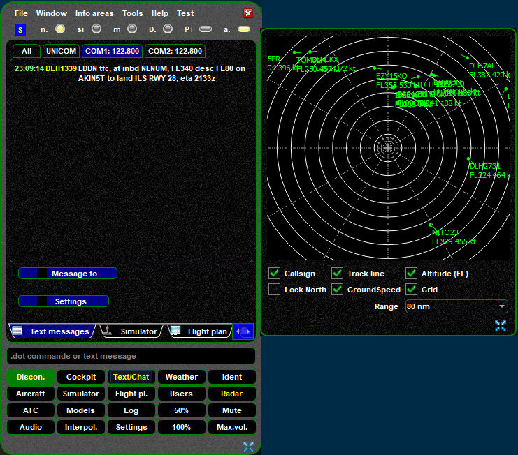
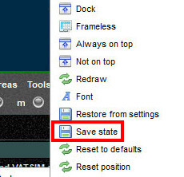

<!--
    SPDX-FileCopyrightText: Copyright (C) swift Project Community / Contributors
    SPDX-License-Identifier: GFDL-1.3-only
-->

*swift*GUI features a **traffic radar** function which is very helpful for maintaining your situational awareness, especially during departure and approach!
This way you cannot only hear who's around you, but you can also see their position, altitude, speed and direction of travel.
When operating on UNICOM, this is a very neat thing and its use is highly encouraged.

{: style="width:50%"}

## Functions

* **Zoom**: you can zoom in and out with the **scroll-wheel of your mouse**, after moving its cursor over the radar display. Alternatively, you can use the ``Range`` drop-down menu
* control the information of other traffic by selecting and de-selecting ``Callsign``, ``Track line`` (current direction of aircraft on your radar), ``Altitude (FL)`` (pressure altitude) and ``GroundSpeed``
* Unless you select ``Lock North``, the top of the radar screen will follow the heading of your own aircraft
* ``Grid`` is the label for those range rings.

## Floating Radar Widget
One useful function is floating/undocking your Radar Widget!
This way you can place it somewhere in your cockpit or on a second screen without the need of having *swift*GUI in the foreground all the time.

This is how you do it:

Select ``Float`` from the context menu of your Radar Widget. This will pop out the radar display in a separate window.

{: style="width:40%"}

To access the context menu, **right-click** on the **textured area** below the radar display, as indicated by the red frame:

{: style="width:50%"}

To make the new window look a bit nicer, open the **context menu** again from the floating window and select ``Frameless``.
This is optional, try it out and see if you prefer it or the standard window mode mode

{: style="width:40%"}

Open the **context menu** one more time and choose ``Always on top`` to keep this window always above any other window/program.
Your radar display will now disappear, but don't despair: click on the Radar Widget on *swift*GUI and your radar display will come back as a floating window and it will stay on top now.

{: style="width:40%"}

You will now have a floating radar display that you can move to any place on your screen(s).

{: style="width:70%"}

**Resizing the floating window** is done by clicking and holding the icon on the bottom right corner.

You can **save the state and position of your floating window(s)** by opening the context menu and selecting ``Save state``.

{: style="width:40%"}

If you wish to **dock the floating window** to *swift*GUI, open the context menu and select the option ``Dock`` at very top of the list.
When you are not in frameless mode, you can alternatively simply close the floating window by clicking on the ``X`` in the top right corner of it.
