<!--
    SPDX-FileCopyrightText: Copyright (C) swift Project Community / Contributors
    SPDX-License-Identifier: GFDL-1.3-only
-->

This widget allows you to access all settings pages of *swift*.
When selected for the first time in a new session of *swift*GUI, it will take you to the **Overview page**.
From there you can access all subpages either by clicking on the buttons on the Overview page or by selecting one of the tabs on top.

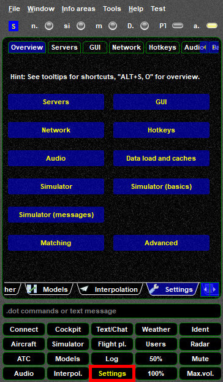{: style="width:50%"}

## Servers
On the Servers page you can manage connection data for private FSD servers.
This includes setting up swift for use as **TowerView**.
More details **[on this page](./../flying/tower_view.md)**.

## GUI
On GUI you can control basic appearance properties of *swift*GUI, such as the type of the font used, its size, style and color.
You can also control GUI's opacity (transparency).
You will find two Widgets on the GUI labelled ``50%`` and ``100%``, they are quick settings for GUI's transparency.

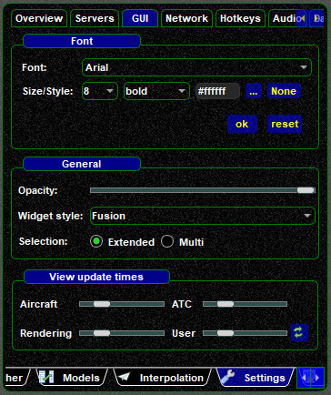{: style="width:50%"}

## Network
The first part is reserved for possible future use.
In the lower half you can review and change the download interval times for METAR data, VATSIM's network status file (Data file) and VATBOOK (Bookings) data.
Avoid choosing very short download intervals to avoid overloading the servers.
Unless you are experiencing issues, do not alter these values.

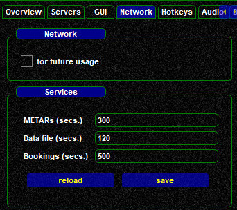{: style="width:50%"}

## Hotkeys
This is the place where you manage your hotkeys.

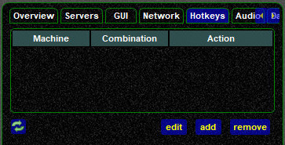{: style="width:50%"}

* you can ``add``, ``edit`` and ``remove`` hotkeys
* you can assign **multiple keys or buttons** to **one single** function
* you have to define at least one joystick button or keyboard key as **Push-To-Talk (PTT)**, otherwise you won't be able to talk to other users on the network

### Add a new Hotkey

As an example, add a PTT hotkey combination:

* select ``add``
* **Action**: select a function, ``Voice`` ==> ``Activate push-to-talk``
* **Combination**: click on ``[Select]`` and then **press the button/key** that you want to use as PTT
* finish the process by selecting ``Ok``
* changes to your hotkey definitions will be saved permanently only when you shutdown *swift*GUI, a prompt will ask you whether you want to save those changes or not

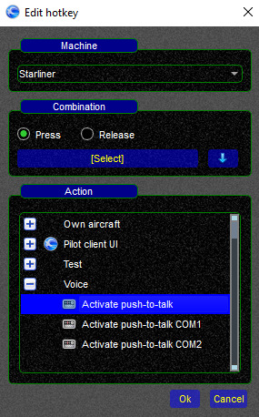{: style="width:40%"}

### Edit an existing Hotkey

* select an existing hotkey assignment from the list and click on ``edit``
* **Action**: you can either keep the same function for this hotkey assignment or change it to something else
* **Combination**: to define a different hotkey assignment, click on ``[Select]`` and then **press the button/key** that you want to use from now on
* finish the process by selecting ``Ok``
* changes to your hotkey definitions will be saved permanently only when you shutdown *swift*GUI, a prompt will ask you whether you want to save those changes or not

### Remove an existing Hotkey

* select an existing hotkey assignment from the list and click on ``remove``
* changes to your hotkey definitions will be saved permanently only when you shutdown *swift*GUI, a prompt will ask you whether you want to save those changes or not
* if you removed a hotkey assignment by accident, instead of defining it again, you can also shutdown *swift*GUI without saving the hotkey changes

## Audio
By clicking on this, you can modify the audio notifications settings, **[as described on the main Audio page](./audio_page.md)**

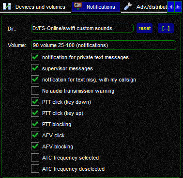{: style="width:40%"}

## Data load and caches
This page shows you the status of your local data cache and also what the swift Datastore holds.
To update/refresh your local data cache, best use swiftLauncher and there select the section **[Check for Updates](./../swift_launcher.md)**.
You will find an identical table there, plus a button at its bottom, labelled ``load from DB``.
Pressing it, will synchronize your local cache and swift's Datastore.

## Simulator
The Simulator page contains some important parameters that some users may want to amend.
Most of the settings will only be available for change once flight simulator is running **and** connected to *swift*GUI.

The upper part of this page will list all installed plugins for the simulators that users selected when they installed *swift* pilot client.
You can select/de-select the ones that you are using/not using.

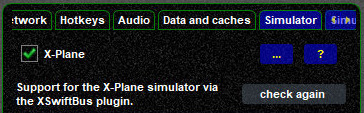{: style="width:40%"}

The lower section offers some general setting options

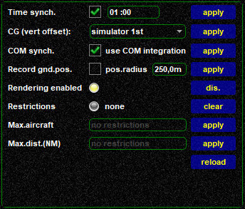{: style="width:40%"}

* **COM synch.**: you can activate/deactivate COM radio synchronization here, but also on the **[Audio widget](./audio_page.md)** (click link for explanation)
* **Rendering enabled**: you can disable the rendering (drawing) off all aircraft by clicking on ``dis.``. This will set Max.aircraft and Max.dist(NM) both to zero.
* **Restrictions**: the ``clear`` button will delete all rendering restrictions
* **Max.aircraft**: if you want to limit the number of aircraft that swift is allowed to render (draw), this is the place to go
* **Max.dist(NM)**: you can also limit the rendering (drawing) radius around the position of your own aircraft, the unit is NM (nautical miles)

Furthermore, you can also modify settings that are specific to each flight simulator platform used.
Depending on the product, there more or less options available.
To access them you need to click on the ``[...]``-icon in the same line as the simulator plugin, in this example xswiftbus for X-Plane 11:

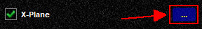{: style="width:40%"}

A new window will pop up:

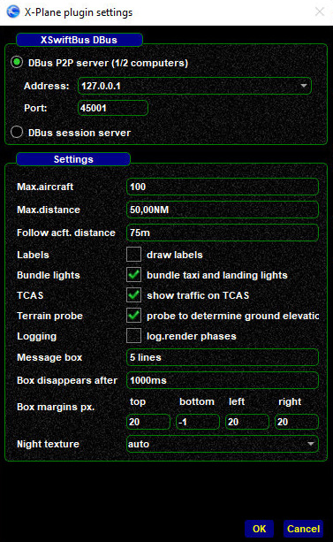{: style="width:40%"}

* In the top section you will find setting options for *swift's* DBus, that will be more relevant for distributed (networked) use of *swift*.
  Standard should be as shown on the screenshot.
  More information can be found **[here](./../distributed.md)**.
* The main **Settings** section gives you control over quite a few parameters, some of them are specific to X-Plane 11 (in this example):
    * **Max.aircraft**: like on the general settings page, you can control the number of aircraft *swift* is allowed to be rendered (drawn)
    * **Max. distance**: like on the general settings page, you can control the radius around your aircraft's position where aircraft are allowed to be rendered (drawn)
    * **Follow aircraft distance**: a unique feature for X-Plane, set the **default distance** when following other aircraft in your simulator, [more information](./aircraft_page.md).
    * **Labels**: allows you to **permanently** enable or disable drawing information-labels (aircraft tags) to the planes that *swift* renders in X-Plane 11. Note: you can also control the label status via X-Plane's Plugins menu (xswiftbus), but the change there will be valid for the current session of *swift*GUI only!
    * **Bundle lights**: will try to switch on both taxi and landing lights for other aircraft, even when they only transmit that their landing lights are on
    * **TCAS**: self-explanatory
    * **Terrain probe**: specific to X-Plane 11, allows *swift* to render other aircraft at the elevation of your own scenery
    * **Logging**: debugging log option
    * **Message box**: X-Plane specific, controls how many lines of text will be shown in-game
    * **Box disappears after**: X-Plane specific, controls how long the text box will be shown in-game, in milliseconds. 1000ms = 1 second
    * **Box margins px.**: X-Plane specific, controls the margin (distance) of the in-game text and the text, in pixels
    * **Night texture**: if a night texture has been defined, you can control *swift*GUI's behaviour regarding it

All changes need to be acknowledged by clicking on the ``OK``-button.
Only when closing the *swift*GUI, the program will ask you to permanently save and write those changes.

## Simulator (basics)
**Simulator (basics)** contains the settings for your flight simulator path(s) and optional aircraft model paths.
This page can also be found in the *swift* [Configuration Wizard](./../flying/swift_launcher_wizard.md) (more information on the linked page) and in *swift*Data (Mapping Editor).
Normally users do not need to change anything on this page.

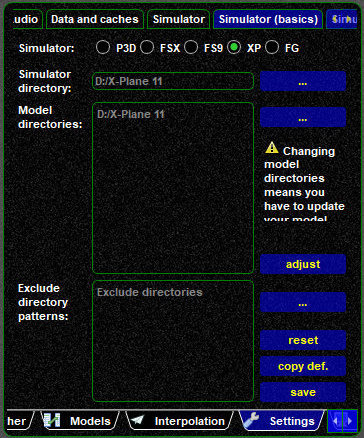{: style="width:40%"}

## Simulator (messages)
This page lets you configure pop-up messages for certain events, no matter whether *swift*GUI is on the foreground, or not.
A good setting is as shown below:

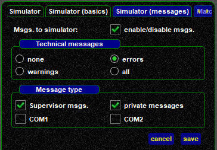{: style="width:40%"}

----
## Matching
*swift*'s **Matching** settings can be altered to tweak the behaviour of its model matching logic.
By default, *swift* will first try to display the correct type of aircraft, the livery is of secondary importance.
Model matching is a complex task and normally you should be fine with the settings that come with the basic installation.

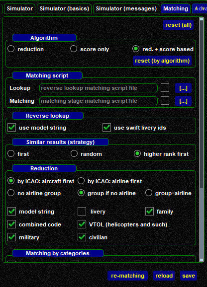{: style="width:40%"}

If you feel like experimenting, have a go.
To retrieve *swift*'s default settings, click on the ``reset(all)`` button on the top right corner.

## Advanced
On this page you enable or disable the upload of crash dumps to *swift*'s development team.
