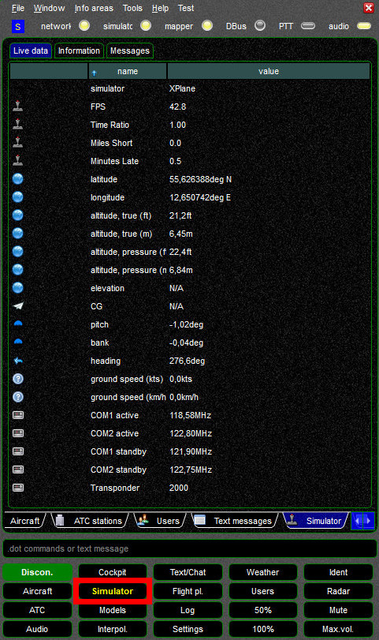

<!--
    SPDX-FileCopyrightText: Copyright (C) swift Project Community / Contributors
    SPDX-License-Identifier: GFDL-1.3-only
-->

All parameters that *swift* is reading directly from your flight simulator platform are displayed on this page, including your current frame rate (FPS).

{: style="width:60%"}
