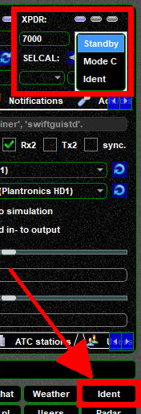

<!--
    SPDX-FileCopyrightText: Copyright (C) swift Project Community / Contributors
    SPDX-License-Identifier: GFDL-1.3-only
-->

On top of *swift*GUI you will find a **status bar** that is comprised of a number of **virtual LEDs** (=status lights).

{: style="width:70%"}

## Transponder
On the far left you can verify the current status of your **ATC Transponder**

|||
|-|-|
| {: style="width:20%"} | **STBY** = standby, transponder is not transmitting data |
| {: style="width:20%"} | **CHARLIE** = ON, transponder is transmitting data |
| {: style="width:20%"} | **IDENT** = ident-mode is activated temporarily |

Preferably you will **operate the transponder panel in the cockpit of your flight simulator platform**.
*swift* is synchronized to it and code and mode changes should occur accordingly.

Should the transponder panel of your virtual aircraft not be compatible with *swift*, then you can toggle between STBY and ON modes manually by clicking on the transponder light in in the status bar or in the Cockpit Widget of *swift*GUI.
If you need to change your transponder code or select IDENT, then this can be done in the Cockpit Widget, too.
There's a quick access IDENT button as well.

{: style="width:25%"}

|||
|-|-|
|  |The network status light indicates whether you are connected to a server or not (= offline). The screenshot features the LED being OFF. |
|  |This LED will only light up, when *swift*GUI is connected to your flight simulator platform. |
|  |This just means that the aircraft model mapper is active. |
|  |when you run *swift* in [Distributed Mode](./../distributed.md), this should be lit, because DBus must be active for it to work. |
|  |**PTT** is "**PushToTalk**" and its status light will be active for as long as you are pressing a PTT key. |
|  |This status light indicates that your Audio codec was initialized successfully. |
