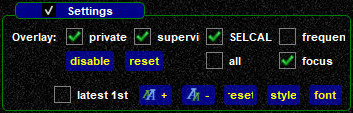

<!--
    SPDX-FileCopyrightText: Copyright (C) swift Project Community / Contributors
    SPDX-License-Identifier: GFDL-1.3-only
-->

The Text/Chat page is where you will access all text messages on COM radio channels, private chat conversations and network broadcasts by supervisors and administrators.

{: style="width:50%"}

## Text Tabs
You will find several tabs on top of the Text/Chat page.
They are home to all received and sent text messages.

By default there are 4 tabs:

{: style="width:50%"}

* **All**: this channel combines **all** text messages that are sent and received on any of the other tabs
* **UNICOM**: *swift*GUI will show you all transmitted text messages on 122.800, even **without this frequency being tuned** in any of your radios
* **COM1**: all text messages that are sent and received on the frequency that is tuned in COM Radio 1
* **COM2**: all text messages that are sent and received on the frequency that is tuned in COM Radio 2

Private chat dialogues and network broadcasts will be opened in separate tabs and they may be outside the border of this dialogue.
You can use the the arrow click-spaces or the scroll-wheel of your mouse to switch between tabs.

## Message to
This section of the page will feature a number of clickable buttons that you can use to open private chat dialogues with ATCOs in your range.

* you can show or hide these buttons by clicking on the checkmark or the empty box, respectively, next to the label ``Message to``
* text shortcut buttons will only be shown when you are in range of ATCOs
* when you click on one of those buttons, a new tab will open and you can start typing a message in the command line
* you can close private chat tabs by clicking on ``[x]`` at the right side of the tab-title or on the large ``Close`` button below the private chat message box.

{: style="width:50%"}

Another way to start a private chat with an air traffic controller is using the [context menu on the ATC Page](./atc_page.md).

## Settings
Here you can configure the behaviour and look of text messages.
You can show or hide this part of the page by clicking on the checkmark or the empty box, respectively, next to the label ``Settings``.

{: style="width:50%"}

  * Overlay: select the type of message(s) that you want to trigger a pop-up window when *swift*GUI is not focussed on the text/chat tab where such a message is received
    * **private chat** messages
    * **supervisor** messages
    * **SELCAL** messages for the code that you have configured in *swift*GUI
    * **frequency**: any text message sent on the frequencies that you have set active on COM1 and COM2
    * **disable**: de-select all overlay-options
    * **reset**: reset all overlay-options to default
    * **all**: select all overlay-options
    * **focus**: enable pop-up windows for selected message types. When you are not displaying the text/chat page of *swift*GUI while a message arrives that fulfils your settings, a separate message window will pop-up to make you aware of a new message.
    {: style="width:50%"}

  * **latest 1st**: by default, newer messages will be pasted below older messages. Activating this option will reverse this order
  * **text size**: increase or decrease font size
  * **reset**: reset text style to default
  * **style**: directly edit the CSS style sheet for text messages
  * **font**: choose a different font and text styles

## Command Line
At the bottom of the Text/Chat page you will find the Command Line.

{: style="width:50%"}

All text messages that you want to send **to a frequency/channel or to private chat tabs** go in here.

The Command Line is also used to enter **[Dot Commands](./../../troubleshooting/dot_commands.md)**.
