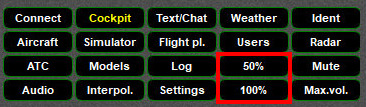

<!--
    SPDX-FileCopyrightText: Copyright (C) swift Project Community / Contributors
    SPDX-License-Identifier: GFDL-1.3-only
-->

You will find two Widgets labelled ``50%`` and ``100%`` on the GUI.
They represent quick settings for the opacity (transparency) of the client.

{: style="width:50%"}

You will find further options to control *swift*GUI's opacity on the **[Settings Widget](./settings_page.md)**.
