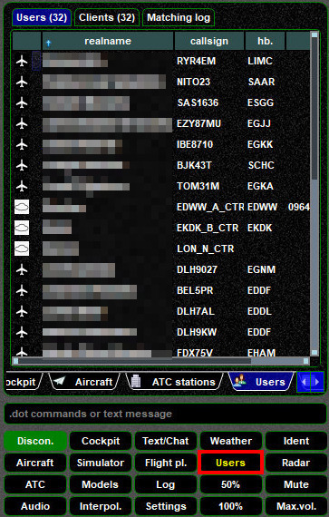
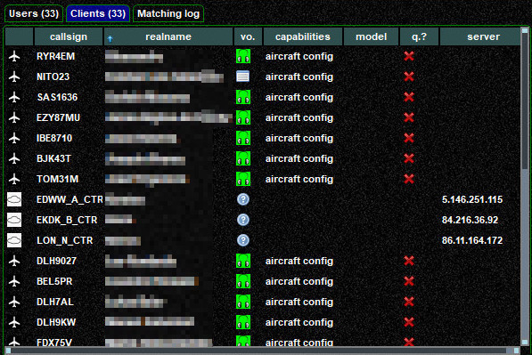

<!--
    SPDX-FileCopyrightText: Copyright (C) swift Project Community / Contributors
    SPDX-License-Identifier: GFDL-1.3-only
-->

The Users Widget will provide you with two different kinds of lists of other users in your vicinity.

One tab is labelled ``Users`` and shows some general information about other people around your position:

{: style="width:50%"}

The second tab is called ``Clients`` and has some more information, e.g. voice capability

{: style="width:70%"}

The last tab, ``Matchin log``, is identical to the one that you can also find in the **Models Widget**. [More information](./models/index.md#matching-log)
