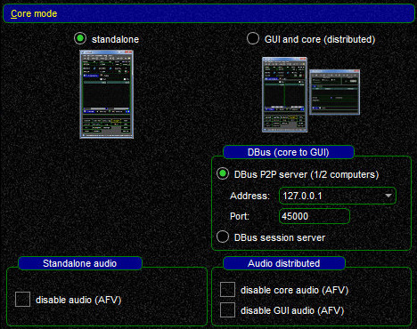

<!--
    SPDX-FileCopyrightText: Copyright (C) swift Project Community / Contributors
    SPDX-License-Identifier: GFDL-1.3-only
-->

*swift*Launcher can be used to access all components of *swift*, to update the client, *xswiftbus* and the database and to change the operational mode of the pilot client.

## Window Type
In this section you can configure whether you wish to run *swift*GUI in a **normal window** with frames or frameless.
This setting will only take effect when you start *swift*GUI through *swift*Launcher.
When you start through the standard program shortcut, this setting will not be used, unless you [add a parameter with a Command Line Argument](./../troubleshooting/command_line_arguments.md).

## Core Mode
This section is interesting for users who would like to run *swift* on a remote computer, the so called **[Distributed Mode](./distributed.md)**.
For all other users it is important to have this set to ``standalone``.

## Check for updates
This part of *swift*Launcher is all about program and database updates and managing them.
[Updating swift](./../home/updating/index.md)

## Tools
In tools you can find shortcuts to several log and settings directories and if you want to clear your Windows Registry of swift-entries, this can be done here.
[See also here](./../home/uninstall.md)

## Start application
You can start any component of *swift* by clicking on its icon here.

