<!--
    SPDX-FileCopyrightText: Copyright (C) swift Project Community / Contributors
    SPDX-License-Identifier: GFDL-1.3-only
-->

!!! note

    This chapter is for users who have installed *swift* **for the very first time** or who are making a clean installation and do not have previous configurations to copy their settings from.
    If you are an existing user and if you have copied all settings during installation of *swift* pilot client, then the only thing that you need to do in the Configuration Wizard is **[update XSwiftBus](./configure_xp.md#xswiftbus-wizard)**!
    All other settings can be managed through *swift*GUI.

You may also use this **[Tutorial Video](https://youtu.be/iBcy72CRYSI?t=253)**  :simple-youtube: to guide you through the Configuration Wizard of *swift*.
You can find more tutorials on this **[dedicated page](./../video_tutorials.md)**.

After the program installation has finished, **swiftlauncher** will start automatically.
If, from there, the **Configuration Wizard** did not launch by itself, start it manually:

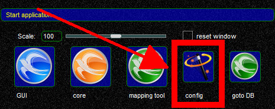{: style="width:50%"}

!!! note

    Should you have de-selected the option to launch *swift* Configuration Wizard during the program installation, it is possible to run the same initialization mode any time later by using the command line arguments ``swiftlauncher -i --bootstrapurl %%https://datastore.swift-project.org/shared/%%``

## Legal Wizard

The first wizard page deals with the necessary legal bits.

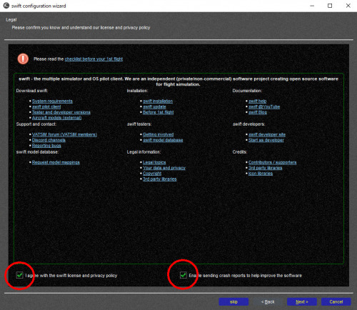{: style="width:80%"}

* **accept** license and data protection policy. **Required item**.
* this page also asks for your **agreement to submit crash reports** to our crash report collection server. **Voluntary item**.

**About sending crash reports:** In case that any *swift* application crashes, a report will be generated with information about which line of code caused this.
With your agreement, the report will be uploaded to our server and helps the developers to diagnose and fix the cause.
This agreement can be changed anytime later in the **advanced settings** dialogue in ***swift*GUI**.

## Data Loading Wizard

The next wizard will download all data form the database of *swift* **automatically**.
You may continue to the next configuration page - data loading will continue in the background.
This data is required by *swift* to be fully functional.
**It is not necessary to click any of the load buttons**.

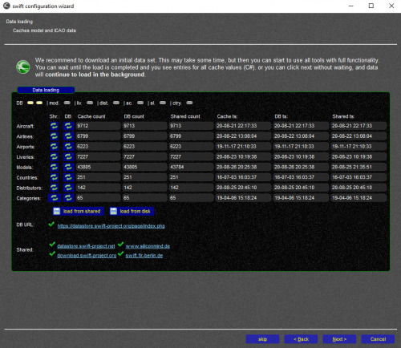{: style="width:80%"}

## Copy Models Wizard

!!! note

    This page can be skipped, should you have no previous copies of *swift* installed on your computer.

If you had a previous version of *swift* installed already, then this wizard will help you migrate your existing aircraft model cache and model set to the new version of *swift*:

* select the older version you want to migrate from the list
* select whether you want to migrate the model set and/or model cache and for which simulators
* click the button ``start copy``

## Copy Settings Wizard

!!! note

    This page can be skipped, should you have no previous copies of *swift* installed on your computer.

If you had a previous version of *swift* installed already, then this wizard will help you migrate your settings:

* select the older version you want to migrate from the list
* select the settings to copy from the older version: either one by one or use the button **select all** on the bottom
* greyed out items mean that no user setting is available and the default setting is in use. They cannot be selected
* click on the button ``copy``

## Simulator Wizard

This page allows you to configure which flight simulator programs you want *swift* to work with and what model directories will be used or excluded.

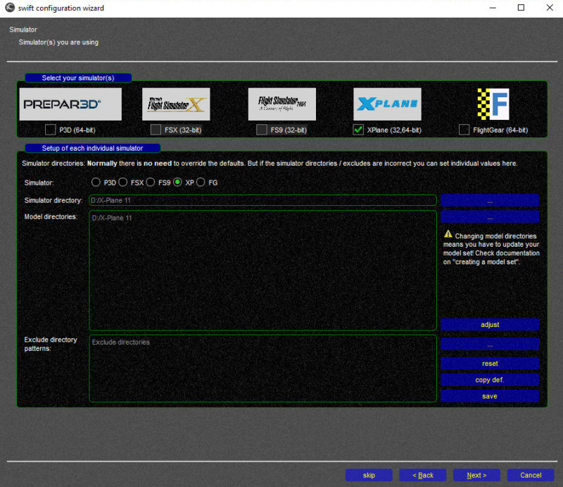{: style="width:80%"}

### Select your simulator(s)
If you have multiple simulators installed and use them regularly, select all of them at the top of the page.
Otherwise just select the one flight simulator platform, that you are using.

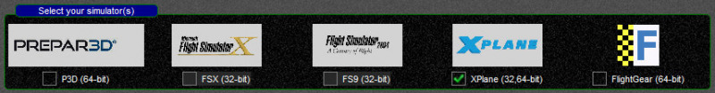{: style="width:80%"}

### Setup of each individual simulator

In this you are able to configure the simulator path and any additional model directories.

* **Simulator**: select the flight simulator platform that you want configure the paths for.
  Even if you have only one flight simulator platform installed, make sure that the correct one has been selected!

    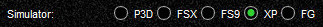{: style="width:70%"}

* **Simulator directory**: check if it is correct

    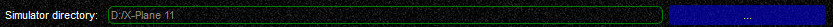{: style="width:90%"}

    *swift* will try to detect as much as possible automatically and use it as default.
    Automatically detected data is shown in **light grey letters**.
    If the detected path is correct, there is no need to do anything more in this box.
    If it is not, click on ``...`` to select the correct path.

* **Model directories**
    If you do not have any CSL models installed, or if you are not sure about it, or if you would like to install more models, [proceed to this page](./../models/xplane/index.md) on our website.

    !!! note

        before you add any directories here, read this: by default, *swift* will not preset any directories here and as long as no paths are inside this box, *swift* will search all subdirectories of your flight simulator.
        It may be desirable to also list the aircraft that you usually fly yourself with, for use in the Mapping Tool.
        As soon as you add one or more paths to this box, *swift* will be restricted to searching for aircraft and CSL models in these paths **only**, **nowhere else**!

    * to select/add more directories, use the ``...`` button
    * to remove redundant directories, fix file paths etc., use the **``adjust``** button
    * after you have made changes, you have to select **``save``**, or your changes to the paths will be lost

## First Model Set Wizard
This wizard will help you create your **first, basic model set to get you started**.
Each of the flight simulator platforms that you want to use with *swift* has to have its own model set.

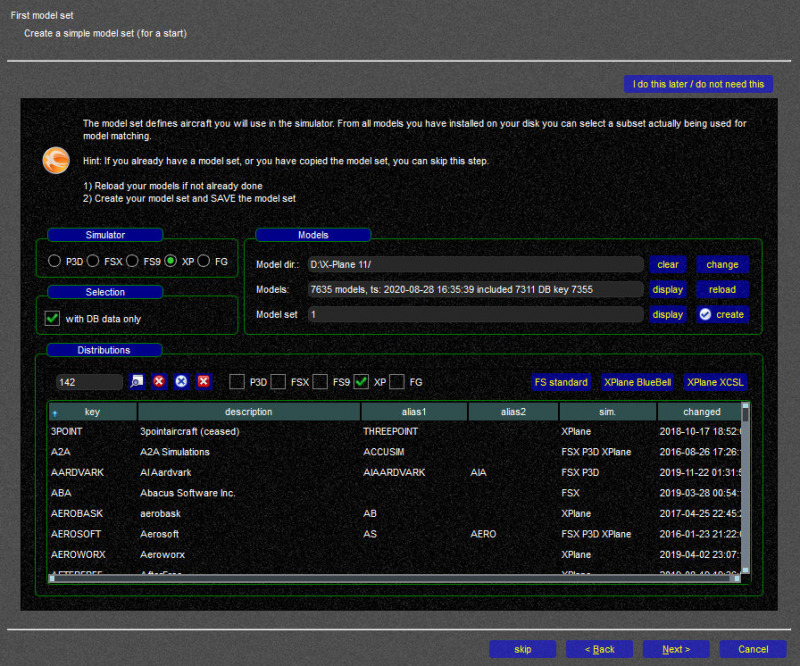{: style="width:70%"}

!!! note

    There will be **no** fine-tuning, **no** filtering: you will just **add all aircraft models** that *swift* can find **inside the paths that you have defined** in the previous section.
    If you want to perform some more elaborate work on your model set, you will need to use the **Mapping Tool** (*swift*Data app).
    Visit the **section about the Mapping Tool in the documentation** and check out our **[YouTube Video Tutorial: Working with the Mapping Tool](https://youtu.be/hqOsjmV7wus)** :simple-youtube:

A model set consists of CSL (Common Shape Library) models that **have to be installed** on your computer somewhere **inside the X-Plane folder**.
Without any models installed and without any model set, *swift* will not run properly, because it won't have anything to create and render the aircraft of other pilots around you with.

### Simulator & Selection

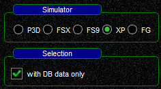{: style="width:40%"}

* select the flight simulator platform, that you want to create a first model set for. In this case choose ``XP`` for X-Plane
* keep the check mark activated at ``with DB data only``

### Models
Now it's time to actually search for existing models, list them as your **Stored Own Models** and then add them to your **Active Model Set**.

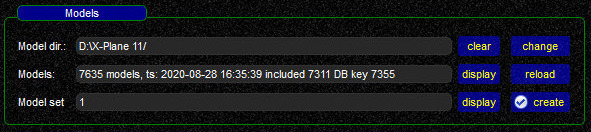{: style="width:80%"}

- **Model dir.:** check the model directory/directories and if necessary change it/them - best practice would be doing this on the previous page ([Simulator Wizard](./configure_xp.md#simulator-wizard))
- **Models:** (in the **swift Mapping Tool** this is labelled as **Stored Own Models**)
    * click on ``reload`` to scan your model directory/directories.
      The result will be a pop-up message window, listing all aircraft and CSL models that *swift* was able to find.
      In case that you get **a few error messages only**, close the error message pop-up window ``x`` and continue with **Model Set**.
    * But should you find entries that contain information like **Unsupported IVAO CSL format - consider using CSL2XSB**

        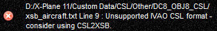{: style="width:80%"}

        then **you have to run** the **CSL2XSB** converter script.
        Proceed to the **[CSL2XSB Model Converter Page](./../models/xplane/csl2xsb_converter.md)**.
        **When you are done with converting your models, continue here on this page.**

- **Model Set:** (in the **swift Mapping Tool** this is labelled as **Active Model Set**)
    * click on ``create``
      This will extract all valid CSL models from **Models** (Stored Own Models) and insert them into your **Model Set**, a window with a list of models will pop up
    * select ``save for XPlane`` to **save your Active Model Set**.
      Failing to do so will result in losing your changes to the model set

        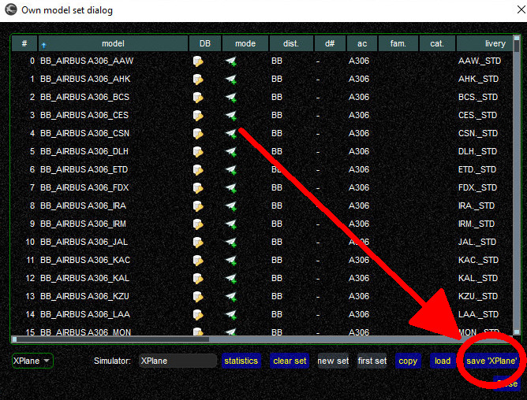{: style="width:80%"}

Believe it or not, but you just created your first model set for *swift*, well done!

## XSwiftBus Wizard

!!! warning

    The **XSwiftBus plugin** is required for **X-Plane** **only**.

XSwiftBus Wizard will download and install XSwiftBus for you.

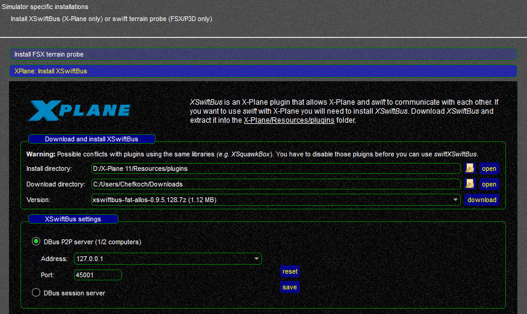{: style="width:80%"}

*swiftGUI* is not a plugin for X-Plane and in order to exchange data with X-Plane and to render CSL models, a plugin called XSwiftBus is necessary.
It has to be installed into your **X-Plane plugins-folder** (found at ``YourDrive:\X-Plane 11\Resources\plugins``).

*swift* will be using the X-Plane program directory that you had confirmed on the ([Simulator Wizard page](./configure_xp.md#simulator-wizard)).

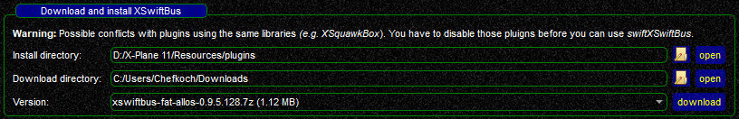{: style="width:80%"}

* **Install directory:** check the correct plugins-directory of X-Plane is shown
* **Download directory:** check the folder where XSwiftBus will be downloaded to.
  If you are happy with it, leave it, or change it to your preference
* **Version:** choose the **correct version** of XSwiftBus: it **has to** be the **same version number** as *swift* pilot client that you are configuring now!
  For example, if you are installing *swift* 0.9.5.128, then XSwiftBus has to have the same version number 0.9.5.128
* after selecting the correct version, select ``download`` and follow the instructions to install the plugin

!!! note

    in case that you do **not** have **[7zip (freeware)](https://www.7-zip.org/)** or if it isn't available for your OS at all (e.g. MacOS), *swift* will produce an error message.
    You will then have to **install XSwiftBus manually** by extracting the archive to ``X-Plane 11\Resources\plugins\`` (overwriting existing xswiftbus files there).

## Hotkey Wizard

The **Hotkeys Wizard** allows you to configure hotkeys.

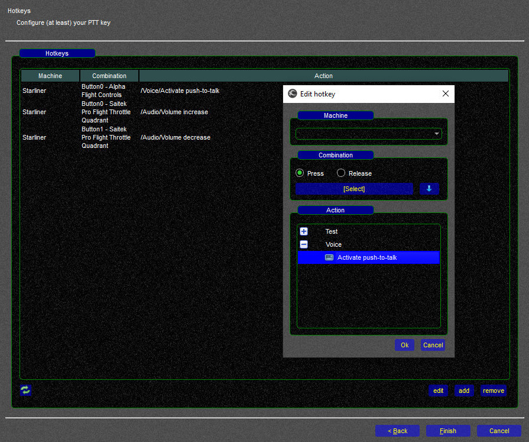{: style="width:70%"}

You have to define at least one joystick button or keyboard key as **Push-To-Talk (PTT)**, otherwise you won't be able to talk to Air Traffic Controllers.\

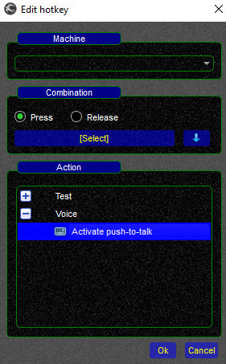{: style="width:40%"}

* you can assign **multiple keys or buttons** to **one single** function
* you can ``add``, ``edit`` and ``remove`` hotkeys

### Adding a new Hotkey
* select ``add``
* **Action**: select a function, ``Voice`` ==> ``Activate push-to-talk``
* **Combination**: click on ``[Select]`` and then **press the button/key** that you want to use as PTT

!!! tip

    The Config Wizard presents you only with a reduced selection of hotkey-functions to get you started with a PTT key.
    You can find **many more hotkey-functions** in the **[hotkey settings](./../../documentation/swift_gui/settings_page.md)** in the *swift***GUI application**

      {: style="width:40%"}

## Congratulations
**You are now done configuring** *swift*!

Go ahead and start *swiftGUI*.
You can do this through *swiftLauncher* by clicking on the blue *swift* icon  or through the *swiftGUI* shortcut.

!!! tip

    you can configure your *swiftGUI* shortcut to start the client in **frameless** mode by adding ``-w f`` to it.
    Your "target" should then look like this ``YourDrive:\YourDirectory\swift-x.x.x-64bit\bin\swiftguistd.exe -w f``

Before your **first flight** check out this **[Tutorial Video](https://youtu.be/7HTrfqXy4nU)** :simple-youtube: to take our program tour of *swift*GUI and show you further setup options.

You can find more tutorial videos on this **[dedicated page](./../video_tutorials.md)**.
