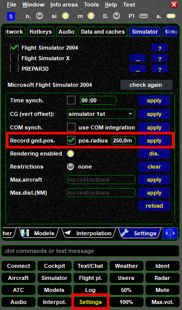

<!--
    SPDX-FileCopyrightText: Copyright (C) swift Project Community / Contributors
    SPDX-License-Identifier: GFDL-1.3-only
-->

Issue: FS9 is a legacy simulator platform and has no ground elevation probe and also no "ground flag" for multiplayer aircraft.

The solution is to use your own aircraft's elevation as field elevation.
In order to use it, you will have to to enable this option.

You can only do this when FS9 is **running and connected** to *swift*GUI (multiplayer session):

* in *swift*GUI select the **Settings Widget**
* click on **Simulator**
* set a checkmark in the box next to ``Record gnd.pos.`` and fill in a figure, in this example ``250`` (no unit required), then ``apply``
* only when you shutdown *swift*GUI it will ask you to save or discard changes to your FS9 settings

{: style="width:50%"}

In this example you would use your ground elevation within a radius of 250 meters (about 250 yards).
