<!--
    SPDX-FileCopyrightText: Copyright (C) swift Project Community / Contributors
    SPDX-License-Identifier: GFDL-1.3-only
-->

# Configure FS9

!!! note

    This chapter is for users who have installed *swift* **for the very first time** or who are making **a clean installation** and do not have previous configurations to copy their settings from.
    If you are an existing user and if you have copied all settings during installation of *swift* pilot client, then you don't need to run the Configuration Wizard!
    You can manage all your settings through *swift*GUI.

!!! danger

    Make sure you have installed the **32bit version of** *swift*, otherwise it will **not** work with FS9.

After the installation has completed, **swiftlauncher** will start automatically.
If, from there, the **Configuration Wizard** did not launch by itself, start it manually:

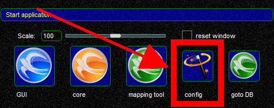{: style="width:70%"}

!!! note

    Should you have de-selected the option to launch *swift* Configuration Wizard during the program installation, it is possible to run the same initialization mode any time later by using the command line arguments ``swiftlauncher -i --bootstrapurl %%https://datastore.swift-project.org/shared/%%``

## Legal Wizard

The first wizard page deals with the necessary legal bits.

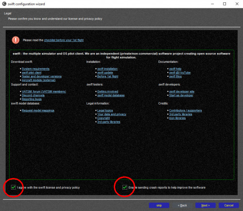{: style="width:80%"}

* **accept** license and data protection policy. **Required item**.
* this page also asks for your **agreement to submit crash reports** to our crash report collection server. **Voluntary item**.

**About sending crash reports:** In case that any *swift* application crashes, a report will be generated with information about which line of code caused this.
With your agreement, the report will be uploaded to our server and helps the developers to diagnose and fix the cause.
This agreement can be changed anytime later in the **advanced settings** dialogue in ***swift*GUI**.

## Data Loading Wizard

The next wizard will download all data form the database of *swift* **automatically**.
You may continue to the next configuration page - data loading will continue in the background.
This data is required by *swift* to be fully functional.
**It is not necessary to click any of the load buttons**.

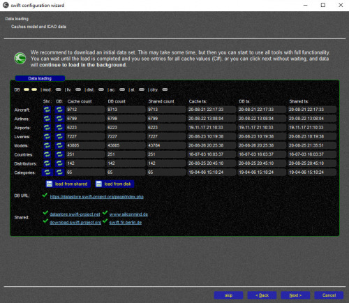{: style="width:80%"}

## Copy Models Wizard

!!! note

    This page can be skipped, should you have no previous copies of *swift* installed on your computer.

If you had a previous version of *swift* installed already, then this wizard will help you migrate your existing aircraft model cache and model set to the new version of *swift*:

* select the older version you want to migrate from the list
* select whether you want to migrate the model set and/or model cache and for which simulators
* click the button ``start copy``

## Copy Settings Wizard

!!! note

    This page can be skipped, should you have no previous copies of *swift* installed on your computer.

If you had a previous version of *swift* installed already, then this wizard will help you migrate your settings:

* select the older version you want to migrate from the list
* select the settings to copy from the older version: either one by one or use the button **select all** on the bottom
* greyed out items mean that no user setting is available and the default setting is in use. They cannot be selected
* click on the button ``copy``

## Simulator Wizard

This page allows you to configure which flight simulator programs you want *swift* to work with and what model directories will be used or excluded.

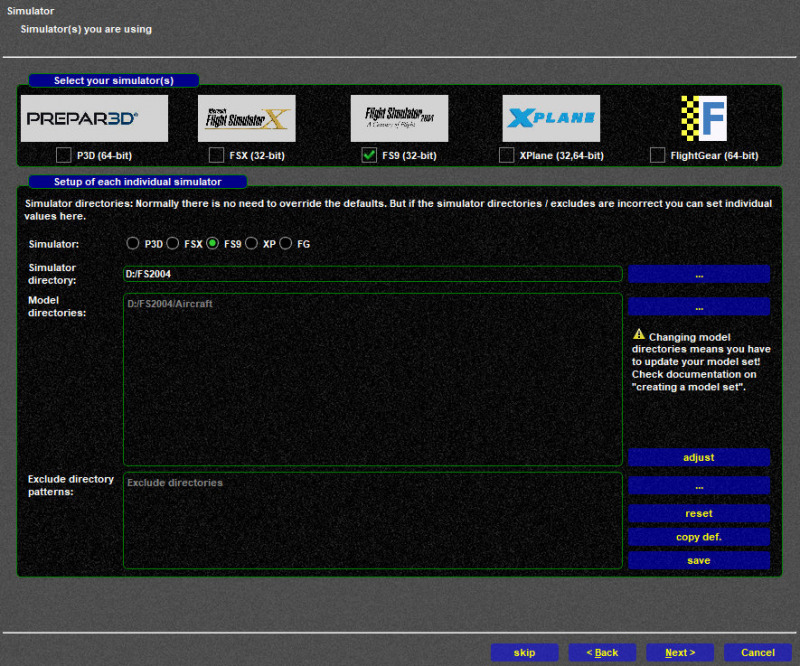{: style="width:70%"}

### Select your simulator(s)
If you have multiple simulators installed and use them regularly, select all of them at the top of the page.
Otherwise just select the one flight simulator platform, that you are using.

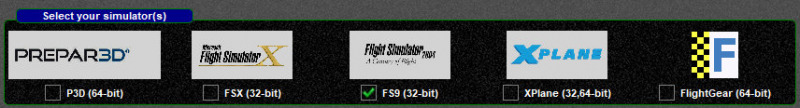{: style="width:70%"}

### Setup of each individual simulator

In this you are able to configure the simulator path and any additional model directories.

* **Simulator**: select the flight simulator platform that you want configure the paths for. Even if you have only one flight simulator platform installed, make sure that the correct one has been selected!

    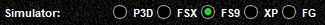{: style="width:70%"}

* **Simulator directory**: check if it is correct

    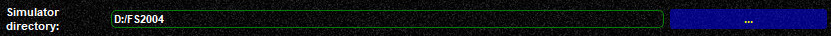{: style="width:70%"}

    *swift* will try to detect as much as possible automatically and use it as default. Automatically detected data is shown in **light grey letters**. If the detected path is correct, there is no need to do anything more in this box. If it is not, click on ``...`` to select the correct path.

* **Model directories**

    If you do not have any AI aircraft installed, or if you are not sure about it, or if you would like to install more models, [proceed to this page](./../../models/fs9.md) on our website.

    !!! note

        By default swift will add the subdirectory ``Aircraft``.
        swift will be restricted to searching for aircraft and CSL models in this path, which is fine, because that's where aircraft and AI models have to be placed in FS9.

    * to select/add more directories, use the ``...`` button
    * to remove redundant directories, fix file paths etc., use the **``adjust``** button
    * after you have made changes, you have to select **``save``**, or your changes to the paths will be lost

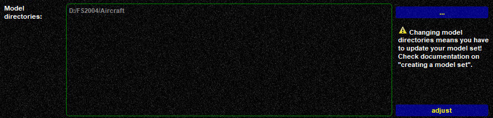{: style="width:70%"}

## First Model Set Wizard

This wizard will help you create your **first, basic model set to get you started**.
Each of the flight simulator platforms that you want to use with *swift* has to have its own model set.

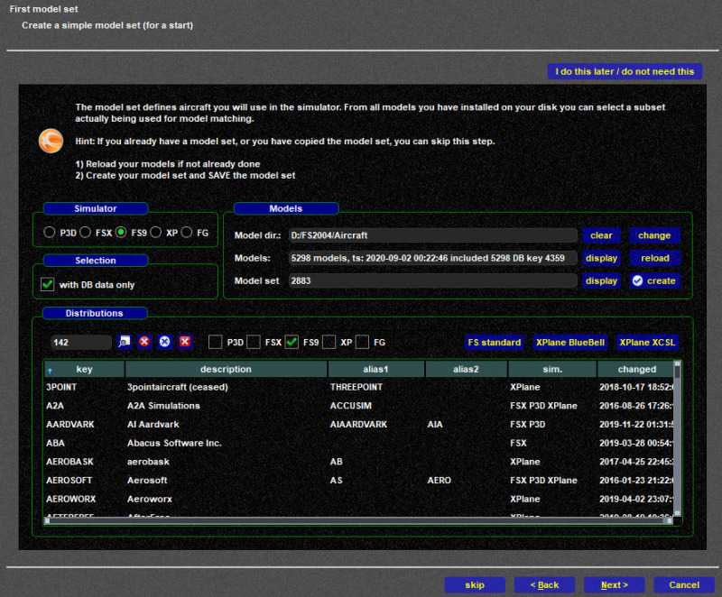{: style="width:70%"}

!!! note

    There will be **no** fine-tuning, **no** filtering: you will just **add all aircraft models** that *swift* can find **inside the paths that you have defined** in the previous section.
    If you want to perform some more elaborate work on your model set, you will need to use the **Mapping Tool** (*swift*Data app).
    Visit the **section about the Mapping Tool** and check out our **[YouTube Video Tutorial: Working with the Mapping Tool](https://youtu.be/hqOsjmV7wus)** :simple-youtube:

A model set consists of AI (Artificial Intelligence) aircraft that **have to be installed** on your computer somewhere **inside the X-Plane folder**.
Without any models installed and without any model set defined, *swift* will not run properly, because it won't have anything to create and render the aircraft of other pilots around you with.
*swift* and FS9 can use **fully flyable aircraft** to render other online pilots, they will work nicely.

### Simulator & Selection

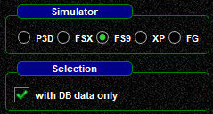{: style="width:30%"}

* select the flight simulator platform, that you want to create a first model set for: choose ``FS9``.
* keep the check mark activated at ``with DB data only``

### Models
Now it's time to actually search for existing AI aircraft models, list them as your **Stored Own Models** and then add them to your **Active Model Set**.

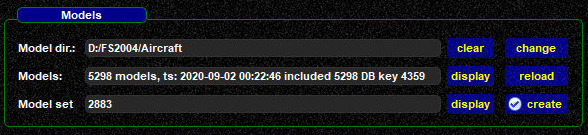{: style="width:70%"}

- **Model dir.:** check the model directory/directories and if necessary change it/them - go back to the previous page and do it in the ([Simulator Wizard](./index.md#simulator-wizard))
- **Models:** (in the **swift Mapping Tool** this is labelled as **Stored Own Models**)
    * click on ``reload`` to scan your model directory/directories. The result will be a pop-up message window, listing all AI aircraft that *swift* was able to find.
      In case that you get a **few error messages only**, close the error message pop-up window ``x``
- **Model Set:** (in the **swift Mapping Tool** this is labelled as **Active Model Set**)
    * click on ``create``
      This will extract all valid AI aircraft from **Models** (Stored Own Models) and insert them into your **Model Set**.
      A window with a list of these models will pop up
    * select ``save FS9`` to **save your Active Model Set**.
      Failing to do so will result in losing your changes to the model set

        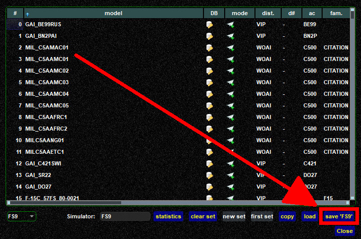{: style="width:70%"}

Believe it or not, but you just created your first model set for *swift*, well done!

## Hotkey Wizard

The **Hotkeys Wizard** allows you to configure hotkeys.

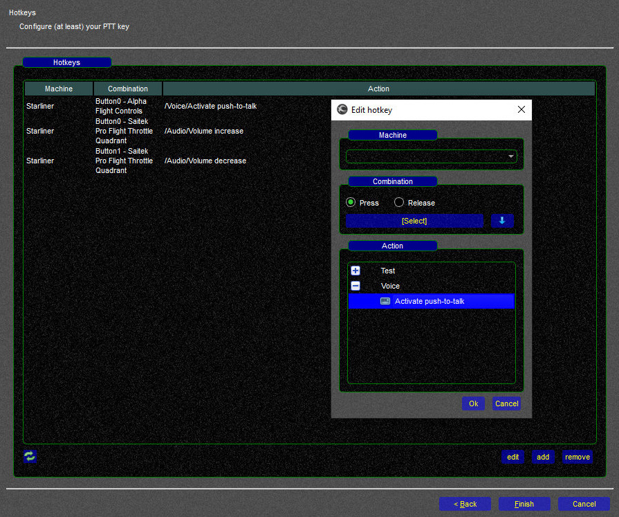{: style="width:70%"}

You have to define at least one joystick button or keyboard key as **Push-To-Talk (PTT)**, otherwise you won't be able to talk to Air Traffic Controllers.\

{: style="width:40%"}

* you can assign **multiple keys or buttons** to **one single** function
* you can ``add``, ``edit`` and ``remove`` hotkeys

### Adding a new Hotkey
* select ``add``
* **Action**: select a function, ``Voice`` ==> ``Activate push-to-talk``
* **Combination**: click on ``[Select]`` and then **press the button/key** that you want to use as PTT

!!! tip

    The Config Wizard presents you only with a reduced selection of hotkey-functions to get you started with a PTT key.
    You can find **many more hotkey-functions** in the **[hotkey settings](./../../../documentation/swift_gui/settings_page.md)** in the *swift***GUI application**

      {: style="width:40%"}

## Congratulations
**You are now done configuring** *swift*!

Go ahead and start *swiftGUI*.
You can do this through *swiftLauncher* by clicking on the blue *swift* icon  or through the *swiftGUI* shortcut.

!!! tip

    you can configure your *swiftGUI* shortcut to start the client in **frameless** mode by adding ``-w f`` to it.
    Your "target" should then look like this ``YourDrive:\YourDirectory\swift-x.x.x-64bit\bin\swiftguistd.exe -w f``

!!! important

    Important: if you run FS9 **'as administrator'** then *swift*GUI must be run **'as administrator'** as well.
    Otherwise you won't be able to connect FS9 to *swift*GUI's multiplayer session.

Before your **first flight** check out this **[Tutorial Video](https://youtu.be/7HTrfqXy4nU)** :simple-youtube: to take our program tour of *swift*GUI and show you further setup options.

You can find more tutorial videos on this **[dedicated page](./../../video_tutorials.md)**.
