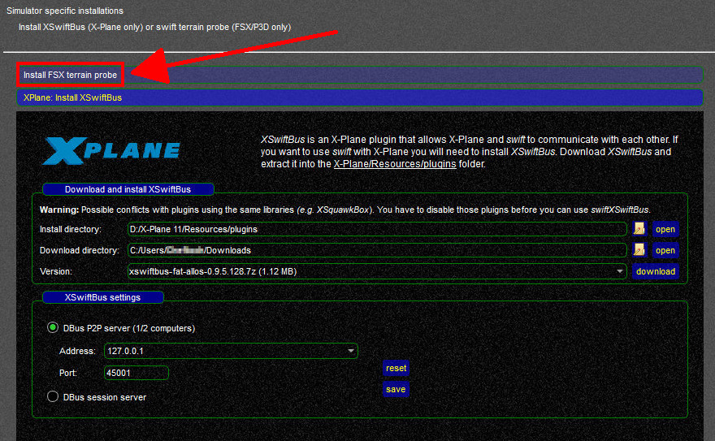
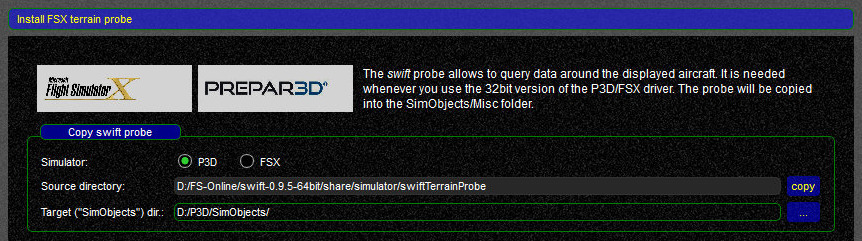
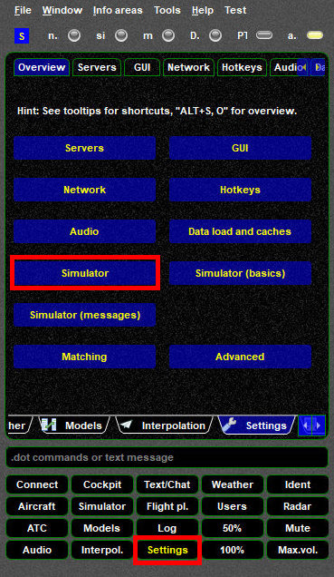
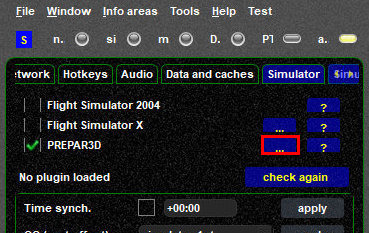
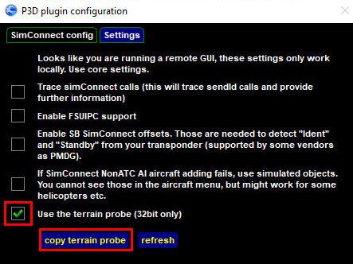
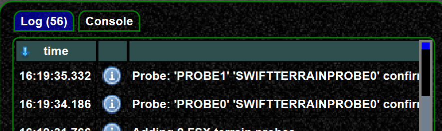
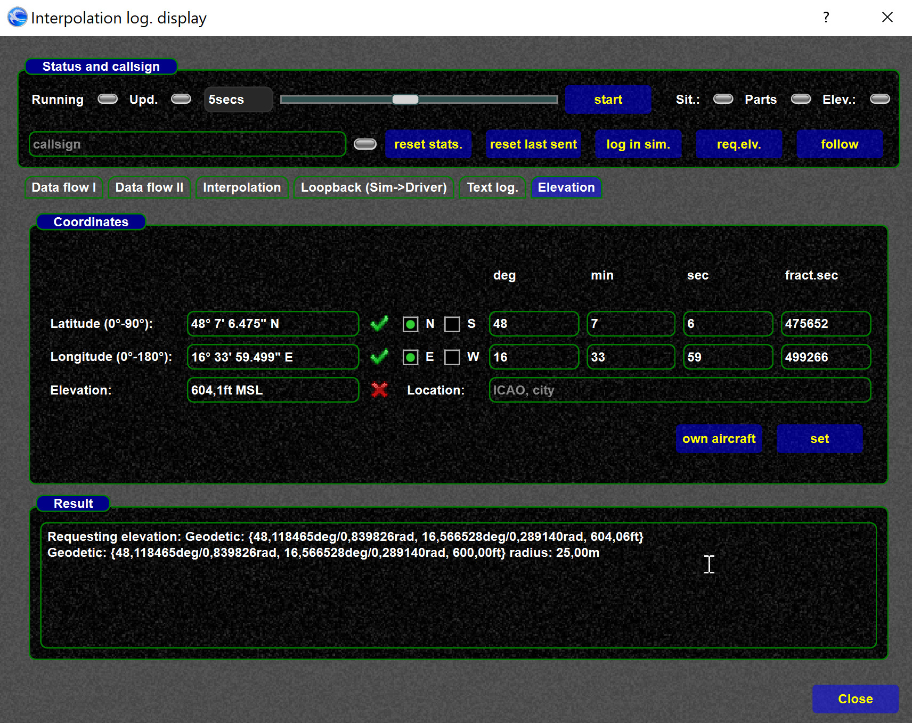

<!--
    SPDX-FileCopyrightText: Copyright (C) swift Project Community / Contributors
    SPDX-License-Identifier: GFDL-1.3-only
-->

For the **32bit FSX/P3D** driver it is recommended to install the **FSX terrain probe**.
The probe allows *swift* to query simulator data around your AI aircraft.

!!! note

    If you are **not** using FSX or P3D v1 to v3, then you will **not** need this addon

!!! danger

    FSX or P3D must be **shutdown completely **before** you can install the Terrain Probe

## There are 3 ways to install the probe

- **Installation through the Configuration Wizard**

    * First click on the blue tab ``Install FSX terrain probe``

      {: style="width:70%"}

    * Then check

      {: style="width:70%"}

      * **Simulator:** correct flight simulator platform selected?
      * **Target ("SimObjects") dir.:** make sure that the SimObjects directory is selected, nothing else, e.g. ``YourDrive:\\P3D\SimObjects\``
      * now click on ``copy`` at the end of the **Source Directory** line - this will copy the Terrain Probe to the correct directory

- **Installation through *swift*GUI**
    * select **Settings** => **Simulator**

        {: style="width:70%"}

    * next to the flight simulator platform that you want to install the Terrain Probe for, click on ``...`` to open a **Plugin Configuration** window

        {: style="width:70%"}

    * change to the **settings tab** of this window
    * at the bottom of the window activate ``Use terrain probe (32bit only)``
    * click on ``copy terrain probe``

        {: style="width:70%"}

  - **Manual Installation:**
    * **locate Terrain Probe** in your *swift* program directory in ``share\simulator\``: ``YourDrive:\YourPath\swift-x.x.x-32bit\share\simulator\swiftTerrainProbe\``
    * copy it manually to the ``SimObjects\Misc\`` directory of FSX/P3D: ``YourDrive:\P3D\SimObjects\Misc\swiftTerrainProbe\``

## Testing the probe
You can **test the terrain probe for correct installation**.

In *swift*GUI select the **Log Widget**.
At the bottom of this page you should see the confirmation that the probe has been added

{: style="width:70%"}

You can also run a full test

* type ``.drv intdisplay`` in *swift*GUI's command-line, this will open the **Interpolation Display** (works only when swift is connected to a flight simulator)
* select the ``Elevation`` tab
* select ``own aircraft`` which should set the coordinates of your own aircraft
* click ``set``
* you should now see a response (2nd line) displaying the ground elevation (supposed to be your own aircraft's elevation - CG)

{: style="width:70%"}
