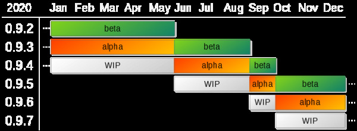

<!--
    SPDX-FileCopyrightText: Copyright (C) swift Project Community / Contributors
    SPDX-License-Identifier: GFDL-1.3-only
-->

# swift Version Numbering

*swift* version numbers consist of three numeric segments. A fourth segment denotes the update patch number.

Some examples:

- **0.9.5** is a version
- 0.9.5.**65** is **update 65** for version 0.9.5
- **update 128** on top of 0.9.5.65 will make it 0.9.5.**128**
- 0.9.5 to 0.9.6 is a **version upgrade**, not just an update

# Release channels

*swift* is currently released as two different channels: **Alpha** and **Beta**

- **Alpha** releases are those that have recently passed the first phase of internal testing.
Early adopters can use an **Alpha** release, helping us by reporting any bugs that we may have missed.
As bugs are found and fixed, updates may be released, also as **Alpha**.

- **Beta** releases have passed this phase of **Alpha** testing and all known bugs are fixed.
Therefore, use the **Alpha** if you want the latest features. Wait for **Beta** if you want minimum bugs.
Additional **Beta** updates may be released if any bugs are discovered later.
After a **Beta** release, the developers begin work on the next version, which will become the next **Alpha** when it is ready.

{: style="width:70%"}
