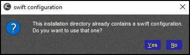

<!--
    SPDX-FileCopyrightText: Copyright (C) swift Project Community / Contributors
    SPDX-License-Identifier: GFDL-1.3-only
-->

# Install swift on macOS

!!! note

    use the dedicated **64bit** MacOS version of *swift* **only**

!!! warning

    Close your flight simulator and all running *swift* applications before starting the installation

Run the *swift* installer and follow the steps as shown.

* **components choice:** normally you don't need to do anything here, just check if your flight simulator platform is listed and selected and then proceed to the next step in the installation process.

    {: style="width:30%"}

!!! warning

    It is advisable to **not** de-select any of the components, or *swift* will not run properly.
    The installer will list all flight simulator platforms that it is compatible with.
    If you wish, you can de-select the ones that you definitely will not be needing.
    E.g. if you're only going to use X-Plane, remove the check marks from all other simulators.

* **swift* pilot client path:** you may select a custom drive and path where you would like to install *swift* pilot client, it can be place anywhere you like.

    {: style="width:70%"}

!!! warning

    Do **not** use a generic name for the actual program path, but rather use the path name that the installer suggests (``swift`` vs. ``swift-0.9.5-64bit``).
    With new versions being released every now and then, it will be much easier to do your house keeping by keeping them separate.

* **Use existing configuration:** At the end of each program installation, *swift* checks your system for previous installations of the client.
Should it find one, the installer will offer you to copy those *swift*-settings to the new version:

    {: style="width:70%"}

> Select "Yes" to copy your settings, as this will save you from configuring *swift* again.
If you are just updating *swift* and you are using **X-Plane**, then you will have to **[update XSwiftBus](./configure_xp.md#xswiftbus-wizard)** (run the **Config Wizard**).

However, if you did **not** get this message, you will have to configure *swift* before you can use it.

By now, *swift* should have started its **swiftLauncher** app. Before you use it, jump to the chapter where we discuss the configuration for each type of flight simulator platform that we support. You can use the directory on the left side or the hyper-links below:

- [Configuration for X-Plane](./configure_xp.md)
- [Configuration for Flightgear](./configure_fg.md)

Should you encounter any problems then see our  **[troubleshooting pages](./../../troubleshooting/index.md)**.
