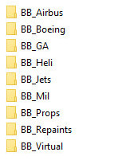
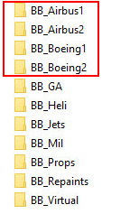

<!--
    SPDX-FileCopyrightText: Copyright (C) swift Project Community / Contributors
    SPDX-License-Identifier: GFDL-1.3-only
-->

# Download and Installation of Bluebell CSL models

Watch our **[YouTube Video Tutorial: BlueBell Model Set Installation](https://youtu.be/htZSvLKTmH8)** :simple-youtube: and follow these steps:

- **[proceed to X-Plane.org](https://forums.x-plane.org/index.php?/files/file/37041-bluebell-obj8-csl-packages/)** and download all the files of the Bluebell model set
- **extract** all downloaded archives into a directory of your choice, for example (as suggested) ``\Custom Data\CSL\BB\``
    * pay particular attention to extracting all archives into the same directory and overwrite existing files for "Airbus" and "Boeing", when prompted
    * in the end it should look like this:

        {: style="width:20%"}

    * should you see folders named ``BB_Airbus1``, ``BB_Airbus2``, ``BB_Boeing1`` and ``BB_Boeing2``, something went wrong during the extraction of BB's archives, it should **not** look like this:

        {: style="width:20%"}

        Should this be the case, enter the directory of ``BB_Airbus2``, select all files, cut and paste them into ``BB_Airbus1``.
        There should be a prompt to overwrite existing files, choose YES and overwrite them.
        Do the same for all files in ``BB_Boeing2``: cut and paste them into ``BB_Boeing1``, overwrite existing files.
        Now, delete the (empty) directories ``BB_Airbus2`` and ``BB_Boeing2`` and rename ``BB_Airbus1`` to ``BB_Airbus`` and ``BB_Boeing1`` to ``BB_Boeing``

- start *swift***Data** app (Mapping Editor)
    * **reload** your **Own** Models (*Force reload*)
    * **re-create** your **Active** Model Set (*New set*)
    * visit the **section about the Mapping Tool** and check out our **[YouTube Video Tutorial: Working with the Mapping Tool](https://youtu.be/hqOsjmV7wus)** :simple-youtube:

!!! note

    Our Tutorial Video about installing Bluebell models is not 100% up to date.
    The "Vertical Offset Fix" that is mentioned in the video is **not** necessary anymore.
    These offsets have been incorporated in the new version of Bluebell already.

