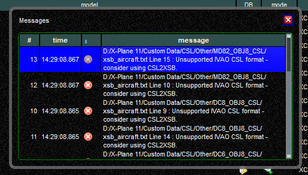
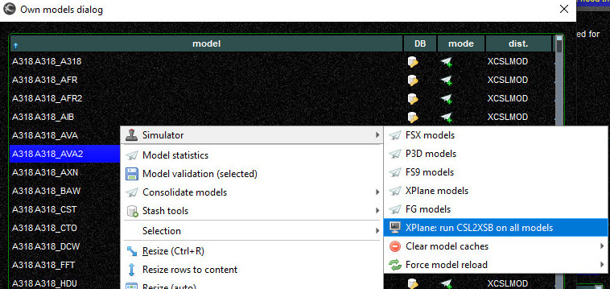
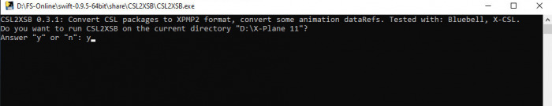
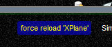
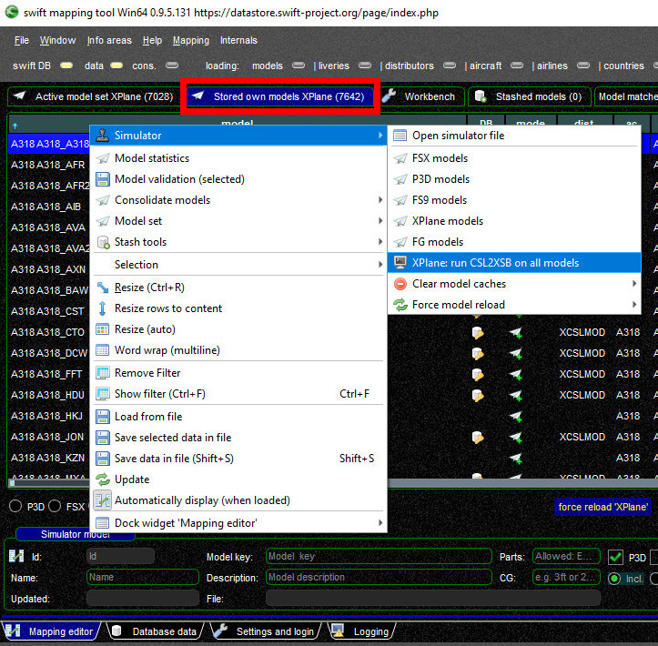

<!--
    SPDX-FileCopyrightText: Copyright (C) swift Project Community / Contributors
    SPDX-License-Identifier: GFDL-1.3-only
-->

**CSL2XSB is a Python script** that will convert X-CSL models to a format that can be understood and rendered by the new **Vulkan/Metal graphics engine of X-Plane 11.50+**.

There's a **difference for users of Windows and MacOS/Linux**.
Please use the respective paragraph.

## CSL2XSB on Windows Systems
The good news **for users of Microsoft Windows** is that the developers of *swift* were able to **integrate** this Python script **into the program**.

Should the *swift* Configuration Wizard or the *swift* Mapping Tool detect models that are not compatible with the new graphics engine of X-Plane 11.50+, it will present an error message like this: **Unsupported IVAO CSL format - consider using CSL2XSB**

{: style="width:70%"}

### Model Conversion - swift Configuration Wizard

In the *swift* **Configuration Wizard** you can convert incompatible models with the **First Model Set wizard**.

**[Tutorial Video showing how to run the converter](https://youtu.be/iBcy72CRYSI?t=423)** :simple-youtube:

* close the model error message pop-up ``x``
* **select any aircraft** from the model list, click on your **right** mouse button (opens context menu)
* select the top option ``Simulator`` and from there ``XPlane: run CSL2XSB on all models``, a command prompt pop-up will open

    {: style="width:70%"}

* type ``Y`` and then hit ``ENTER``

    {: style="width:70%"}

* it may take a while to process all models.
  In the end, the script will ask you to press ``ENTER`` to close the command prompt pop-up
* on your model list pop-up window select ``force reload XPlane`` to **load all models again**, there should be no more error messages related to the unsupported format

    {: style="width:30%"}

Now return to the **[Configuration Wizard Page](./../../install/configure_xp.md#first-model-set-wizard)** of this manual and continue with "**3. Model Set**".

### Model Conversion - swift Mapping Tool

In the *swift* **Mapping Tool** you can convert incompatible models in the **Stored own models** tab.

* close the model error message pop-up ``x``
* **select any aircraft** from the model list, click on your **right** mouse button (opens context menu)
* select the top option ``Simulator`` and from there ``XPlane: run CSL2XSB on all models``, a command prompt pop-up will open

    {: style="width:70%"}

* type ``Y`` and then hit ``ENTER``

    {: style="width:80%"}

* it may take a while to process all models. In the end, the script will ask you to press ``ENTER`` to close the command prompt pop-up
* on your model list pop-up window select ``force reload XPlane`` to **load all models again**, there should be no more error messages related to the unsupported format

    {: style="width:30%"}

You have converted those incompatible models and you have reloaded the model set.
You can now continue working with those models in the Mapping Tool.

## CSL2XSB on MacOS and Linux Systems
Unfortunately it was **not** possible to integrate the CSL2XSB script into the installers for MacOS and Linux.
As a consequence you will have to convert the models manually and we show you here how to do it.

- **Install Python 3+**: is Python 3 or newer installed on your system?
  **[Download page of Python.org](https://www.python.org/downloads/)**
- **Download CSL2XSB Script**: **[download the CSL2XSB script (CSL2XSB.py)](https://forums.x-plane.org/index.php?/files/file/51730-csl2xsb/)** from X-Plane.Org
- **Place Script in Folder**: make a copy of ``CSL2XSB.py`` and place it inside the CSL-folder(s) that you want to convert.
  For example, place it inside ``X-Plane 11\Custom Data\CSL\X-CSL\``.
  When started, the script will search for all model files in this directory and its subdirectories.
  Run the script from a Terminal Command Line, e.g. as ``python3 CSL2XSB.py YourDrive:\\X-Plane 11\Custom Data\CSL\X-CSL``
- **Start the conversion**: in there type ``Y`` and then hit ``ENTER``

    {: style="width:80%"}

- **Return to Configuration Wizard / Mapping Tool**: when CSL2XSB has done its job, depending on where you came from to convert X-CSL models, return to the *swift***Configuration Wizard** or to the **Mapping Tool**
- **Force Reload models**: on your model list pop-up window select ``force reload XPlane`` to **load all models again**, there should be no more error messages related to the unsupported format

    {: style="width:30%"}
