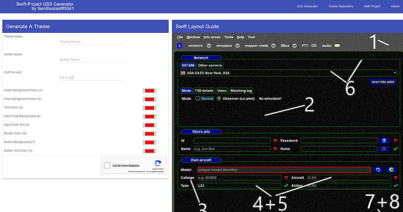
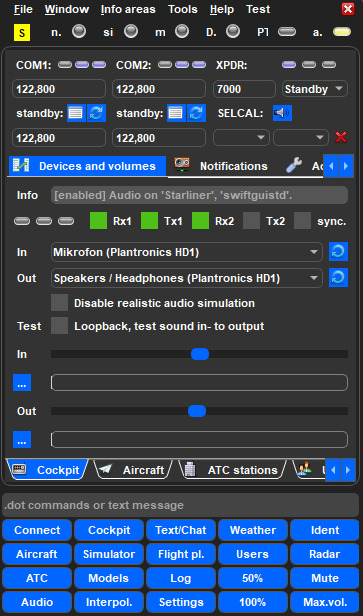
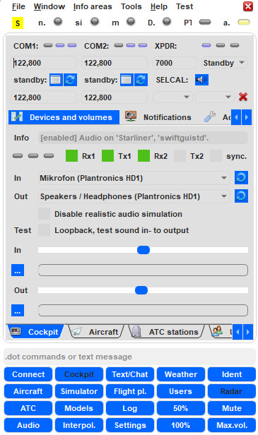
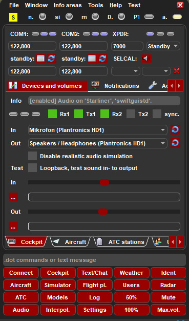

<!--
    SPDX-FileCopyrightText: Copyright (C) swift Project Community / Contributors
    SPDX-License-Identifier: GFDL-1.3-only
-->

Mr fsenthusiast has not only created a couple of **different themes** for *swift*, but also a **Style Sheet Generator for everyone** to use and make their own favourite colour composition for *swift*!

## Download & Generate Themes

Download a ready to use theme or create a custom style sheet: **[fsenthusiast swift Style Sheet Generator](http://fsenthusiast.net/swift/themes.php)**

{: style="width:32%"}
{: style="width:32%"}
{: style="width:32%"}

## Installation
  * themes are **located** in a folder called ``qss``. This folder can be found in ``swift..bit\share\``
  * **make a backup** of your original qss-folder
  * **extract** the new qss-folder to ``swift..bit\share\``.

!!! danger

    With any update of *swift* these qss-files will be overridden.
    You will have to re-install them after updating *swift*.
