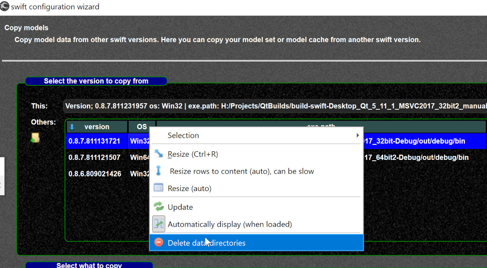
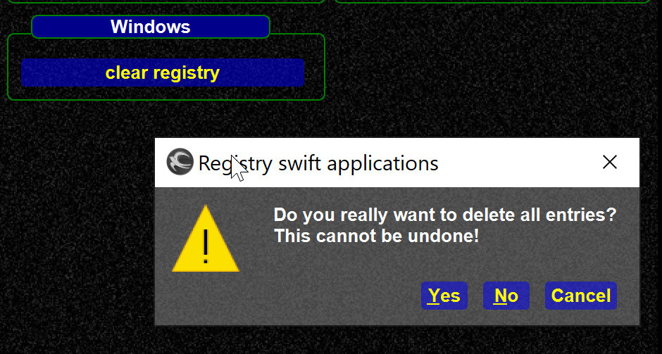

<!--
    SPDX-FileCopyrightText: Copyright (C) swift Project Community / Contributors
    SPDX-License-Identifier: GFDL-1.3-only
-->

## Uninstalling swift pilot client program files
To uninstall *swift* you can use

* the **standard features of your Operating System**
* the **uninstaller application** in the *swift* program directory.

!!! note

    Both methods will uninstall program files only

Your *swift* **settings, model sets and model caches will remain** at another place and won't be affected by the uninstaller.
However, after using the uninstaller, some sub-directories or files of *swift* may remain in its program directory and you may delete them manually after the uninstaller has finished.

## Uninstalling swift settings
If you wish to also **remove swift settings and data**, you have the following possibilities:

* **Configuration Wizard:** you can **delete obsolete** swift data directories of older and unused program versions in the Configuration Wizard.
  Go to the "Copy Models" page of the Wizard, select the version of which you want to delete the settings and data of, with a right mouse-click open the context menu and choose the last option ``delete data directories``
  {: style="width:70%"}

* **manual deleting:**
    * this way you can also delete the settings and data of your current version of *swift*
    * in **Windows** you can find *swift* settings and data on your system drive: ``C:\Users\Username\AppData\Local\org.swift-project``
    * each version of *swift* does create its own sub-directory with lots of strange letters and its version number, for example: ``D%3A%2FFS-Online%2F**swift-0.9.5-64bit**%2Fbin``
    * carefully choose the versions and directories that you wish to delete

## Cleaning up the Windows Registry
If you install with the installer you may delete the following entries (example for 0.9.5):

* ``Computer\HKEY_LOCAL_MACHINE\SOFTWARE\Microsoft\Windows\CurrentVersion\Uninstall\swift 0.9.5``
* ``Computer\HKEY_LOCAL_MACHINE\SOFTWARE\WOW6432Node\Microsoft\Windows\CurrentVersion\Uninstall\swift 0.9.5``
* ``HKEY_CURRENT_USER\Software\swift-project.org``
* ``HKEY_LOCAL_MACHINE\Software\swift-project.org``

*swift* only stores its windows geometry in the registry.
You are able to delete all registry entries in the Tools-section of *swift***Launcher**:

{: style="width:70%"}

* on other Operating Systems you can find the corresponding data here: <https://doc.qt.io/qt-5/qsettings.html#platform-specific-notes>
