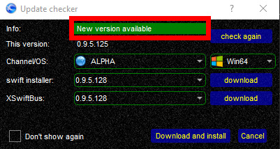

<!--
    SPDX-FileCopyrightText: Copyright (C) swift Project Community / Contributors
    SPDX-License-Identifier: GFDL-1.3-only
-->

# Updating swift

For more information about our version numbering and Alpha vs Beta, **[proceed here](./../install/index.md)**.

## Finding swift Updates
Make sure you **select the correct version channel (Alpha or Beta)** in *swift*GUI and *swift*Launcher.
At program startup, *swift* will automatically query the server for newer versions.

* *swift***GUI** and *swift***Launcher** will automatically alert you to updates

* our *swift* **[download page](./../install/download.md)** always lists the latest public releases

You may also use this **[Tutorial Video](https://youtu.be/p_ncx-j69-Y)**  to update *swift*.

!!! note

    The video is slightly dated in regards to where you can download new versions and updates of the client.
    This is the correct **[download page](./../install/download.md)**.

##  Updating CURRENT version or upgrading to NEW version

**There are some differences** between applying updates to your **current** version of *swift* or upgrading the client to a **new** version.

* To **update a CURRENT version** of *swift* (e.g. 0.9.5.**113** to 0.9.5.**128**), proceed to **[this page](./update_current_version.md)**
* To **upgrade to a NEW version** of *swift* (e.g. **0.9.4**.x to **0.9.5**.x), proceed to **[this page](./upgrade_new_version.md)**
