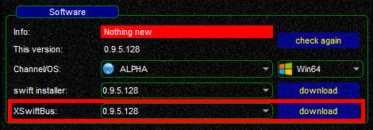
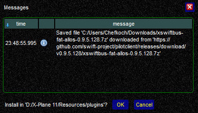
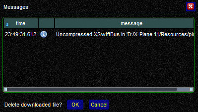

<!--
    SPDX-FileCopyrightText: Copyright (C) swift Project Community / Contributors
    SPDX-License-Identifier: GFDL-1.3-only
-->

You can update *swift* in 3 different ways: through *swift***GUI**, *swift***Launcher** and manually.

!!! danger

    Before you start updating swift, shutdown your flight simulator

## Updating with swiftGUI and swiftLauncher
The **download and installation process** for *swift*GUI *swift*Launcher **is identical**.

* when *swift*GUI or *swift*Launcher have detected an update then **verify** that the **correct version** is selected before selecting ``download``

    {: style="width:50%"}

* the download-dialogue will **download the installer in the background**.
  Please be patient, it will take a few seconds although it may appear as if nothing is happening

    {: style="width:50%"}

* when the **download has finished**, a message will appear and ask you for permission to **install** *swift*

    {: style="width:50%"}

* *swift* will now be installed on your system.
  The installer should **automatically detect** and select previous same versions of the client and suggest this directory to install the update into.
  For example you are currently using 0.9.5.**113** and update to 0.9.5.**128**.
  0.9.5.113 is installed in ``\swift-0.9.5-64bit\``.
  The installer will detect this path and suggest it to you to use: 0.9.5.128 will be installed into this path, overwriting old files
* at the end of the installation process you will be asked if you wish to **use your current settings in the updated version** of swift

    {: style="width:50%"}

If you do **NOT** use **X-Plane**, then you are done here and you can go flying!

## Updating of xswiftbus

* *Users of X-Plane** have to **update xswiftbus**!
* in *swift***Launcher** locate the *xswiftbus*-section and make sure to select **exactly the same version number** as the client that you just installed.
  Select ``download`` to open the download dialogue (don't allow the message **Nothing new** distract you from the fact that xswiftbus requires updating: this message is referring to the *swift* application only)

      {: style="width:50%"}
* in the *xswiftbus* dialogue you have one more chance to verify the version of the plugin.
  Click on ``download`` to actually start the download

    {: style="width:50%"}

* with the download finished, select ``OK`` to install *xswiftbus*

    {: style="width:50%"}

!!! note

    In case that you do **not** have **[7zip (freeware)](https://www.7-zip.org/)** or if it isn't available for your OS at all (e.g. macOS), *swift* will produce an error message.
    You will then have to **install *xswiftbus* manually** by extracting the archive to ``X-Plane 11\Resources\plugins\`` (overwriting existing *xswiftbus* files there)

* when done, you can either keep the archive or delete it.
  Select ``**OK**`` to delete the file or ``Cancel`` to keep it

    {: style="width:50%"}

**You have completed updating *swift* and *xswiftbus*, you can go flying!**

## Updating Manually

* **download** the latest version of *swift* from our website: [download page](./../install/download.md)
* **run** the installer according to your operating system
* the installer should **automatically detect** and select previous same versions of the client and suggest this directory to install the update into.
  Example: you are currently using 0.9.5.**113** and you want to update to 0.9.5.**128**.
  0.9.5.113 is installed in ``\swift-0.9.5-64bit\``.
  The installer will detect this path and suggest it to you to install 0.9.5.128 into.
  Old files will be overwritten.
* at the end of the installation process you will be asked if you wish to **use your current settings in the updated version** of swift

    {: style="width:50%"}

* if you do **not** use **X-Plane**, then you are done here and you can go flying!
* **users of X-Plane** have to **update xswiftbus** as well!
    * either **start** *swift***Launcher** and proceed as described in the previous paragraph of this page
    * or **download and install** *xswiftbus* **manually**: from our [download page](./../install/download.md) get *xswiftbus* with **exactly the same version number** as the client that you just installed.
      **Extract** the archive to ``\X-Plane 11\Resources\Plugins\`` and **overwrite old files**

* **You are now done updating *swift* and *xswiftbus*, you can go flying!**
