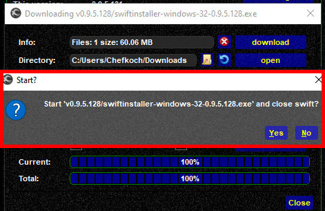

<!--
    SPDX-FileCopyrightText: Copyright (C) swift Project Community / Contributors
    SPDX-License-Identifier: GFDL-1.3-only
-->

When you **upgrade** to a **new version** of *swift*, the installer will **create a new directory**.

Example: your current version is **0.9.4**.389 32bit and it is installed in a directory named ``\swift-0.9.4-32bit\``.
As version **0.9.5** is released, the installer of *swift* will suggest ``\swift-0.9.5-32bit\`` as new folder name.
Use that one.

You can update *swift* in 3 different ways: through *swift***GUI**, *swift***Launcher** and manually.

!!! danger

    Before you begin updating swift, shutdown your flight simulator

## Updating through swiftGUI and swiftLauncher
The **download and installation process** for *swift*GUI *swift*Launcher **is identical**.

* when *swift*GUI or *swift*Launcher have detected an update then **verify** that the **correct version** is selected before you ``download``

    {: style="width:50%"}

* the download-dialogue will **download the installer in the background**.
  Please be patient, it will take a few seconds although it may appear as if nothing is happening

    {: style="width:50%"}

* when the **download has finished**, a message will appear and ask you for permission to **install** *swift*.
  Click ``Yes``

      {: style="width:50%"}

* *swift* will now be installed on your system, in our example into ``\swift-0.9.5-32bit\``
* at the end of the installation process *swift*Launcher and the **Configuration Wizard** will start automatically.
  **Accept the licence agreement** and if you wish agree to sending *swift* crash reports

      {: style="width:50%"}

* ignore the **database wizard**, proceed to the next page
* **Copy models:** here you can copy your model sets and caches from a previous version to the new edition of *swift*.
  It will save you from having to create a new Active Model Set.
  * **select the version** of swift that you want to copy your model set from (in this example it is 0.9.4.389 32bit)
  * **select what you want to copy:** by standard you should **copy both** your previous **Model Set**(=Active Model Set) and **Model Cache**(=Stored Own Models) and then select the flight simulator platform that you want to copy them for (in this example it is FS9)
  * finally click on ``start copy``

      {: style="width:50%"}

  * the Wizard will ask you to **confirm to override** the new model set and model cache with your set and cache from before.
    Select ``Yes`` in both cases.
    When the process has finished, proceed to the next Wizard page

      {: style="width:50%"}
      {: style="width:50%"}

* **Copy settings:** this Wizard allows you to copy your general settings, VATSIM login data etc.
  * **select the version** of *swift* that you want to copy your settings from (in this example it is 0.9.4.389 32bit)
  * **select what settings** you wish to copy. Normally one would ``select all``
  * **when you are ready** for it, click on ``copy``

      {: style="width:50%"}

  * when finished, the Wizard will tell you so

      {: style="width:50%"}

* **Simulator Wizard:** as you may remember from your first installation of *swift*, you have to make sure that your **flight simulator platform is selected** and that its **program path is correct**, as well as the **model directory/directories**
  If everything is fine, continue on the next Wizard page.
  Otherwise correct these settings first and don't forget to ``save`` them!

    {: style="width:50%"}

* **First Model Set Wizard:** here simply check that the correct flight simulator platform is selected and that your **Model set**(=Active Model Set) is not empty. Should it not meet your expectations, then you may want to create a new Active Model Set right here (check **[Initial Configuration Page](./../install/configure_xp.md)** for your flight simulator) or in *swift***Data** (Mapping Tool).

If you do **NOT** use **X-Plane**, then you are done here and you can go flying!

## Updating of xswiftbus
**Users of X-Plane** have to **update xswiftbus**!

* in *swift* Configuration Wizard continue to the *xswiftbus* download page and make sure to select **exactly the same version number** as the client that you just installed.
  Select ``download`` to open the download dialogue

    {: style="width:70%"}

* in the *xswiftbus* dialogue you have one more chance to verify the version of the plugin.
  Click on ``download`` to actually start the download

      {: style="width:70%"}

* with the download finished, select ``OK`` to install *xswiftbus*

      {: style="width:70%"}

!!! note

    In case that you do **not** have **[7zip (freeware)](https://www.7-zip.org/)** or if it isn't available for your OS at all (e.g. MacOS), *swift* will produce an error message.
    You will then have to **install *xswiftbus* manually** by extracting the archive to ``X-Plane 11\Resources\plugins\`` (overwriting existing *xswiftbus* files there)

* when done, you can either keep the archive or delete it.
  Select ``OK`` to delete the file or ``Cancel`` to keep it

      {: style="width:70%"}

**You are now done updating *swift* and *xswiftbus*, you can go flying!**

## Updating Manually

* **download** the latest version of *swift* from our website: [download page](./../install/download.md)
* **run** the installer according to your operating system
* at the end of the installation process *swift*Launcher and the **Configuration Wizard** will start automatically.
  **Proceed according to the instructions earlier on this page** to copy your Model set, Model cache and general *swift* settings
* **users of X-Plane** have to **update xswiftbus** as well!
  * either use the Config Wizward and proceed as described in the previous paragraph of this page or **download and install** *xswiftbus* **manually**: from our [download page](./../install/download.md) get *xswiftbus* with **exactly the same version number** as the client that you just installed.
    **Extract** the archive to ``\X-Plane 11\Resources\Plugins\`` and **overwrite old files**

* **You are now done updating *swift* and *xswiftbus*, you can go flying!**
