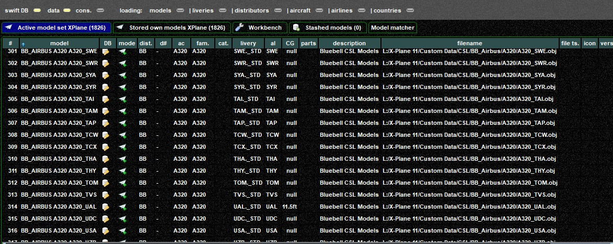
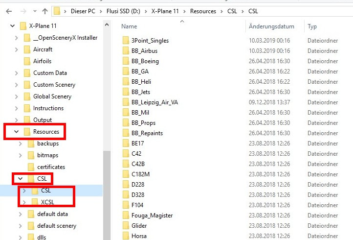
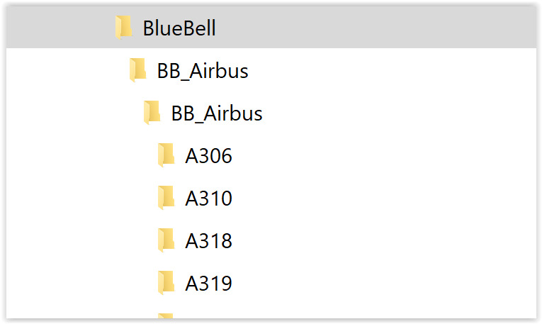
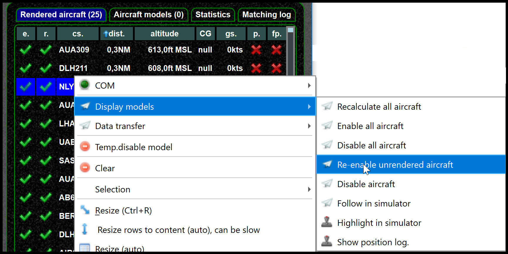

<!--
    SPDX-FileCopyrightText: Copyright (C) swift Project Community / Contributors
    SPDX-License-Identifier: GFDL-1.3-only
-->

## When does it happen?
1.  *swift* receives aircraft information over the network
2.  then it tries to find the most suitable model in the model set.
    This is called model matching.
    You can check model matching, see [matching log](./model_matching/matching_log.md).
3.  next *swift* sends the found model to the simulator.
    Here something goes wrong and the model **is not rendered**.
    You can enable model set validation to check the set each time swift starts, see [model set validation](./../documentation/flying/model_set_validation.md).

## What is the problem?

- All aircraft are not rendered. Something is entirely wrong.
    - Have you moved your models (folder)? If so, reload the models and re-create the model set.
    - For XP11, are your models located in the XPlane folder?
    - did model validation pop-up?
      Then *swift* already tells you your model set is broken.
      You can run the validator in the mapping tool or the *swift* pilot client, see [model set validation](./../documentation/flying/model_set_validation.md).
    - check the paths of your model set, make sure this path represents where your models are, it looks like here

        

-   Some aircraft are not rendered (very few)
    - Do you have models in the set which no longer exist?
    - Another possible reasons: A single model is broken, you could remove that ne from the model set.
    - Have you disabled rendering from the model page?

## General reasons why a model fails to be rendered

- **X-Plane's new Vulkan graphics engine is not supported yet**
- An aircraft is intentionally disabled.
  If you did dot disable it on purpose, see below.
- Check the log page to see if there are errors
- Have you restricted range/number of aircraft?
  See [this article](./../documentation/flying/settings/range.md) for details
- Have you models in your (model) set for which no liveries/installed models exist?
    -   See [model set validation](./../documentation/flying/model_set_validation.md).

## XPlane specific

- Make sure **NO OTHER pilot client plugin is present**
- XPlane models in model set, but not rendered. Solution: **CSL files need to be inside the XPlane folder.**
  Example of a working folder structure:

    {: style="width:70%"}

- If you have installed the vertical offsets, make sure you did not end up with a cascaded folder structure.
    Make sure you only have one `xsb_aircraft.txt` per folder. ..

    {: style="width:50%"}

- Technical reason: X-Plane plugin SDK: `XPLMLoadObject`
    The path for the object must be relative to the X-System base folder.
    <https://developer.x-plane.com/sdk/XPLMScenery/#XPLMLoadObject>
- Static libraries like Fruit Stand do not work with *swift*.
    The Fruit Stand is not a CSL package, they are static scenery models, so that won't work with a pilot client like swift.

## FSX/P3D specific

- The aircraft model is broken.
    You can test that by

    -   [model set validation](./../documentation/flying/model_set_validation.md)
    -   assigning that same model to another callsign, if this fails it is likely to be broken
    -   crosscheck by manually assigning another aircraft to the originally failing one, That should work now.
    -   Possible solution: Manually assign a different model and remove the broken model from the model set.

-   The other side sends a position with a considerable negative offset (below ground)

    -   You see a model failing that normally works
    -   You can try to enable the selected aircraft or use re-enable

        

- You can find models removed by *swift* (because they cannot be rendered) in the mapping tool workbench

    - See [mapping tool tab](./../documentation/swift_data/mapping_tool_tabs.md) under workbench
    - Show removed models in workbench

        

- Check the driver version for P3D (in *swift*'s simulator settings)
- Is the simulator running as ADMINISTRATOR, but *swift* not?
    Or vice versa.

## Re-Enable

You can try to re-enable un-rendered aircraft and see if the issue is gone.

