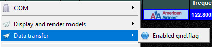

<!--
    SPDX-FileCopyrightText: Copyright (C) swift Project Community / Contributors
    SPDX-License-Identifier: GFDL-1.3-only
-->

Aircraft parts are used to transfer aircraft information about "gear", "spoilers", "flaps", "lights".
They also transfer a **GND flag** to tell if the aircraft is located on ground.
VATSIM uses the parts ground flag.

## Ground. flag / gnd. flag

In the FSD protocol and the related extensions there are 2 ways to transfer a ground flag.
*swift* supports both:

- along with the aircraft parts (VATSIM)
- and as flag in the aircraft position

## How should it be set?

- on VATSIM you will see the parts flag for clients supporting parts, e.g. vPilot and *swift*.
- on VATSIM the GND flag for PARTS is supported, the "other GND flag" not.
- For other servers it depends on the server settings if `GND` and `PARTS` are enabled
- You could even enable the GND flag for an individual aircraft.
    **Never do this unless you know what you are doing!**

    {: style="width:70%"}

- Leave the ground flag and fast position settings alone unless you know what you are doing.

## Model view

You can check the `GND` and `PARTS` in the model view.
