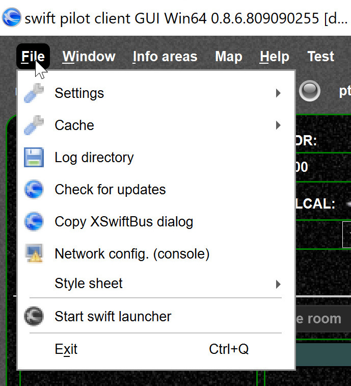
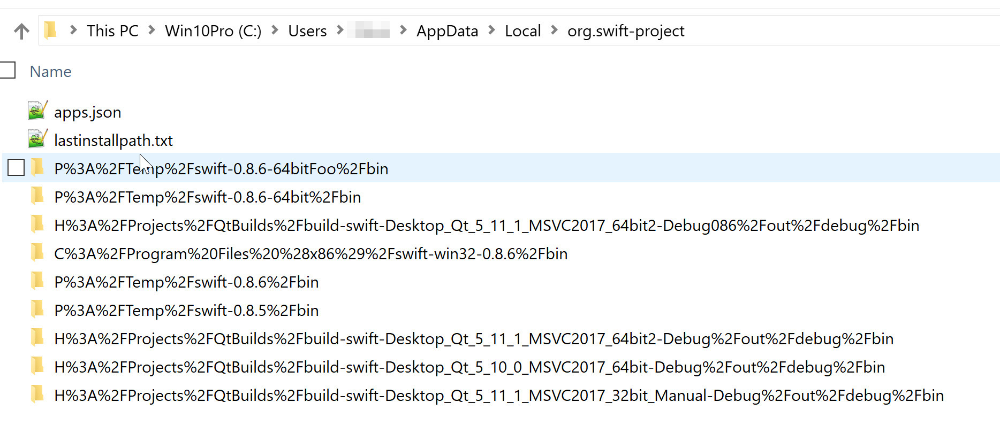

<!--
    SPDX-FileCopyrightText: Copyright (C) swift Project Community / Contributors
    SPDX-License-Identifier: GFDL-1.3-only
-->

You can find the settings and cache files from the swift `File` menu

{: style="width:40%"}

The path is something like here:

-   `C:\Users\JoeDoe\AppData\Local\org.swift-project`
-   If you want to backup all your swift data then backup this directory (backup swift).
-   Then some "magic name" representing your swift installation, like `H%3A%2FProjects%2FQtBuilds%2Fbuild-swift-Desktop_Qt_5_11_1_MSVC2017_64bit2-Debug%2Fout%2Fdebug%2Fbin` + `settings` or `data` (caches)

{: style="width:90%"}

- Each installation of swift has its own data data.
  So you can run as many swift installations as you like.
  If you look at the directory screenshot, you can see that there is **one swift data directory as per swift installation.**
- If you want to temp. reset to default settings, you can just rename the directory to a new name `..._MSVC2017_64bit2-Debug%2Fout%2Fdebug%2Fbin.bak`, note the `.bak` at the end.
  With the next start *swift* creates a new directory with default settings/data.
  By renaming the `bak` file as it was, you will get the settings/data back.
- swift versions are distinguished by their corresponding install directory.
  So if you override an existing installation (same directory), it will use the same data.
  If you install to another place, it will use another data directory.
- If you need to copy data among multiple swift installations you can use the wizard.
- See also: [Find log files](./swift_log_files.md)
- To reset the screen size, see also [Reset screen](./../documentation/flying/settings/reset_screen_size.md)

## Windows Registry (Windows only)

Under Windows *swift* windows geometry data are stored in the registry, see also [Reset screen](./../documentation/flying/settings/reset_screen_size.md).

- `HKEY_CURRENT_USER\Software\swift-project.org`
- `HKEY_LOCAL_MACHINE\Software\swift-project.org`

On other OS you can find the corresponding data here: <https://doc.qt.io/qt-5/qsettings.html#platform-specific-notes>
