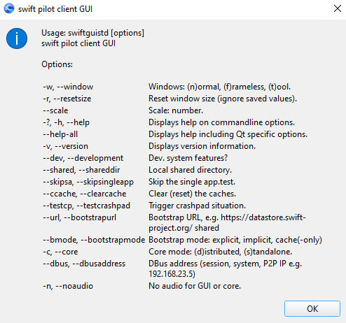

<!--
    SPDX-FileCopyrightText: Copyright (C) swift Project Community / Contributors
    SPDX-License-Identifier: GFDL-1.3-only
-->

!!! note

    see also [Developer Command Line Arguments](./developer_command_line_arguments.md)

You can start all *swift* applications with **Command Line Arguments**, meaning that you **assign parameters** to programs that you run.

## Help Popup
To list all available Command Line Arguments for a *swift* application, you need to run it in the **Command Prompt** with the argument ``--help``, e.g. ``swiftguistd --help``

## swiftGUI Arguments

{: style="width:70%"}

### swiftCore Arguments

{: style="width:70%"}

## Display swiftLauncher Arguments for swift Applications
In *swift*Launcher you can display the Command Line Arguments that it uses to start other components of swift.
To do so, keep your **SHIFT-key pressed** and then **click on the icon** of a *swift* application:

{: style="width:70%"}

Instead of starting the respective application, a popup will show the Command Line Arguments that would have been used for it:

You can select and copy this text and use it to create a program shortcut with these arguments, see next paragraph.

## Modify Windows Program Shortcuts with Arguments

Modifying Windows program shortcuts can be convenient.

For example, if you always wish to start *swift*GUI directly and in frameless mode, then you will have to add the argument ``-w f`` to its program shortcut.

* **locate** the **program shortcut** for *swift*GUI
* **right click** on it and select **Properties** and a popup window will open
* locate the **target line** ("Ziel" in this screenshot) and add the argument ``-w f``

  {: style="width:70%"}

* select ``OK`` to save the change

When you now select this shortcut, it will start swiftGUI in frameless mode.
