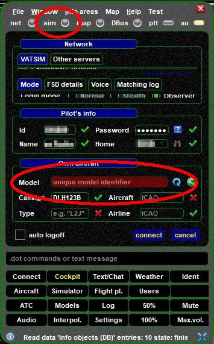
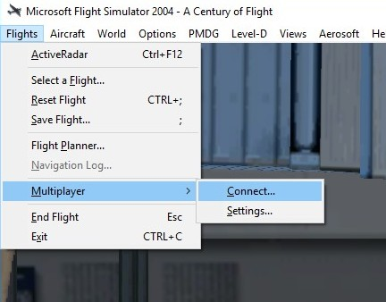
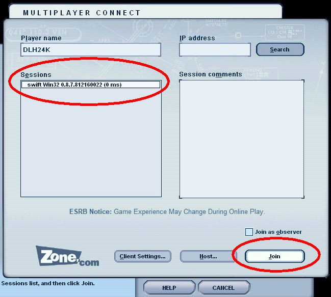
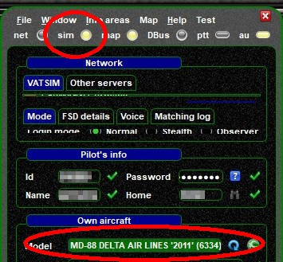

<!--
    SPDX-FileCopyrightText: Copyright (C) swift Project Community / Contributors
    SPDX-License-Identifier: GFDL-1.3-only
-->

Should auto-connect between FS9 and swift not work, you will notice that the status-light on the right side of **sim** is off and swift is not able to detect the **aircraft model** that you are currently using in FS9

{: style="width:50%"}

In order to solve this problem you need to change to FS9 and open the menu **Multiplayer** and choose **Connect**

{: style="width:50%"}

In the connect-dialogue, swift's multiplayer-session should appear within a few seconds.
Select it and then click on **Join**

{: style="width:70%"}

After joining swift's multiplayer-session, change back to swift GUI and check that the status-light next to **sim** is lit and that swift is able to detect your aircraft model

{: style="width:50%"}
