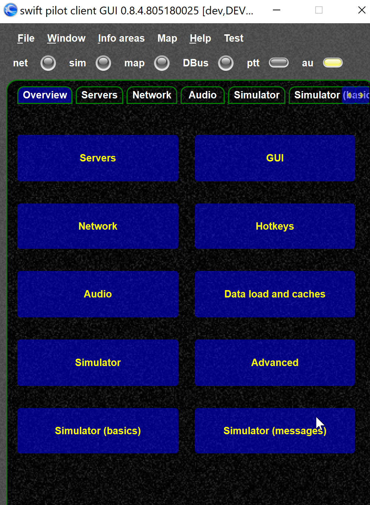
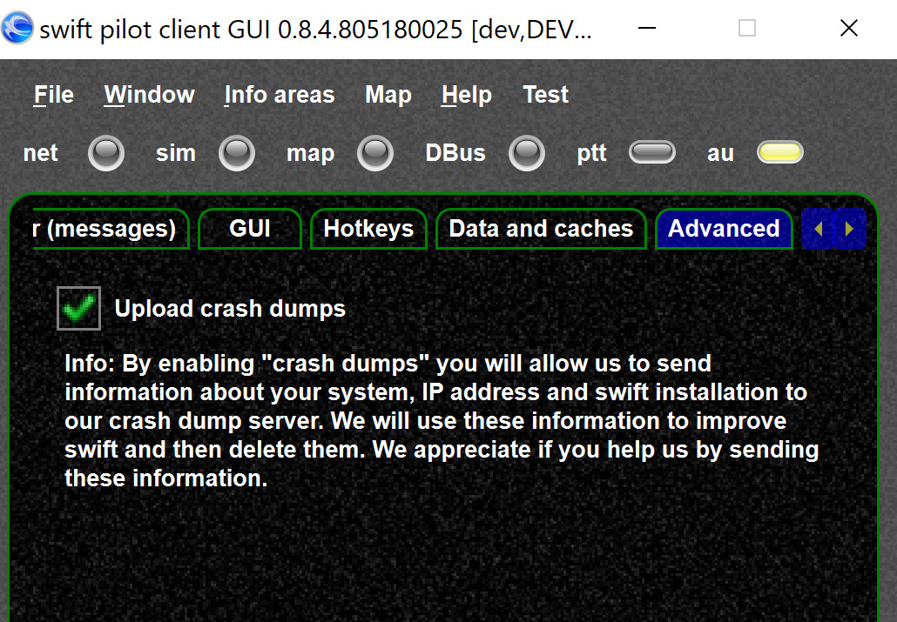
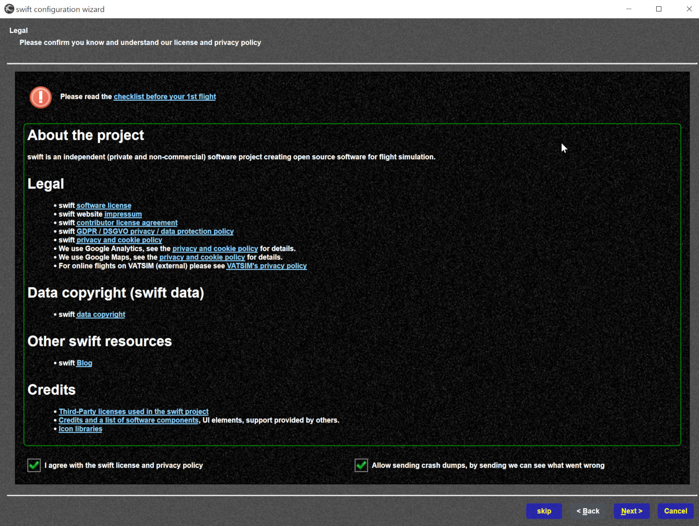

<!--
    SPDX-FileCopyrightText: Copyright (C) swift Project Community / Contributors
    SPDX-License-Identifier: GFDL-1.3-only
-->

swift can send crash reports to our server, so we can check what is going wrong.
However, this is also a privacy issue, as we need to send detailed information.

A crash report includes

- detailed information about your swift installation and runtime environment
- your IP address
- information about your computer hardware

We will store the information until we have resolved the issue and then delete it.
You can help us a lot if you enable crash reports, but if you have privacy concerns just disable it.

{: style="width:40%"}

{: style="width:50%"}

Enable from the wizard's legal page is also possible:

{: style="width:70%"}

swift dump files are located here: [log files](./swift_log_files.md).
