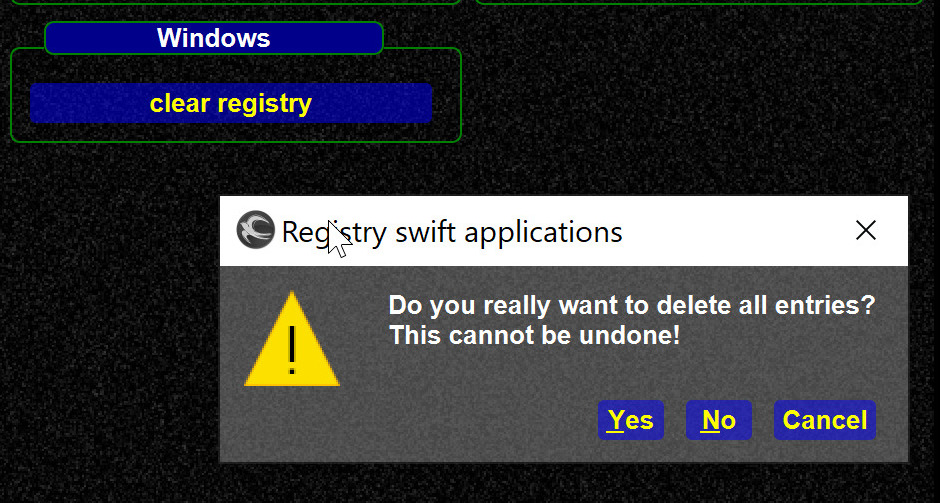

<!--
    SPDX-FileCopyrightText: Copyright (C) swift Project Community / Contributors
    SPDX-License-Identifier: GFDL-1.3-only
-->

The entries can be deleted from the launcher tool menu (since 0.9.4).

{: style="width:50%"}

If you want to do that manually, see <https://doc.qt.io/qt-5/qsettings.html#locations-where-application-settings-are-stored>

**Background**: swift saves screen geometry values (windows positions and sizes) in the registry.
If those are corrupt/invalid (new screen, new screen size) it can cause swift to hang.
