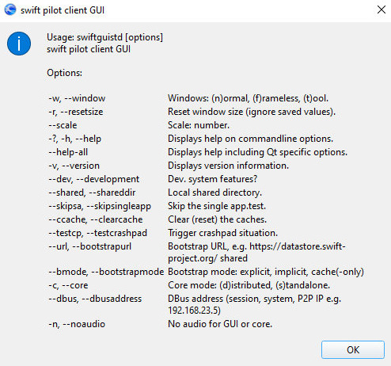

<!--
    SPDX-FileCopyrightText: Copyright (C) swift Project Community / Contributors
    SPDX-License-Identifier: GFDL-1.3-only
-->

see also [swift Command Line Arguments](./command_line_arguments.md)

## Help

Just use `--help` to see a help screen.
You can use `--help` with all executables, as launcher, core and client might have different arguments.

{: style="width:60%"}

## Testing as developer
Normally done like this: `--dev --bootstrapurl https://datastore.swift-project.org/shared/`

- marking as developers provides some extra functionality
- the bootstrap location can also be changed to a test server

Test the dump server: `--testcrashpad`

## Installers
Installer cmd. line: `-i --bootstrapurl https://datastore.swift-project.org/shared/`

- bootstrap URL is mandatory
- use installer mode `-i` to launch wizard

## Testing pilot client with VATSIM live servers

!!! danger

    Installer versions are automatically enabled for VATSIM productive keys.

* Testing interpolation / aircraft parts
    - use swift as "out of the box"
    - any productive servers can be used
    - works with our without simulator attached
    - voice cannot be tested (no connection allowed)

* Testing swift as we will ship it

    - set client id and key, cmd will look something like this: `--serverType vatsim --clientIdAndKey 0xFOO:BAR --dev --bootstrapurl <https://datastore.swift-project.org/shared/`
