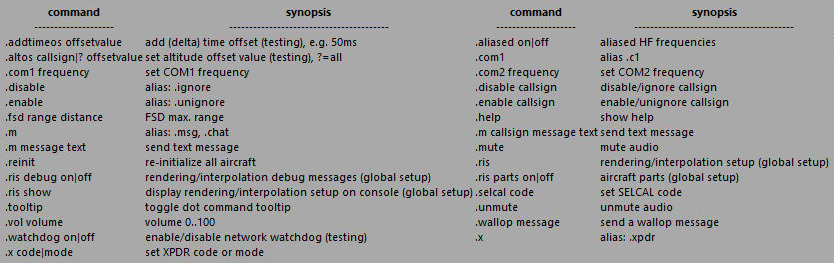

<!--
    SPDX-FileCopyrightText: Copyright (C) swift Project Community / Contributors
    SPDX-License-Identifier: GFDL-1.3-only
-->

*swift* supports a number of dot commands, which can be entered in the [Command Line](./../documentation/swift_gui/text_chat_page.md#command-line).

When you hover your mouse over the Command Line, a **Tooltip Popup** will offer you help as to what Dot Commands are available:

The most relevant dot commands are:

| dot command                                 | Explanation                                                                             | Example                              |
|-|-|-|
| **.m** (or .msg/.chat) [callsign] [message] | Start text chat with another user. **Must** include at least one character as "message" | .m (or .msg/.chat) DLH1797 Hi there! |
| **.com1** or **.c1** [frequency] | Tune active frequency for COM radio 1 | .com1 135.45 |
| **.com2** or **.c2** [frequency] | Tune active frequency for COM radio 2 | .c2 122.80 |
| **.x** [code] | Set transponder code | .x 2000 |
| **.x** [mode] | Set operating mode of transponder (works only if the transponder panel of your aircraft does not override the command | .x stby/c/ident |
| **.vol** [0-100] | Set voice **output** volume with a value between 0 and 100. 50 is standard | .vol 40 |
| **.selcal** [code]  | Set 4-letter SELCAL code in *swift*GUI. Make sure you set a [valid SELCAL code](./../documentation/swift_gui/cockpit_page.md#valid-vs-invalid-selcal-codes)! | .selcal AFGH |
| **.disable** [callsign]  | Disable a specific aircraft, it will not be rendered anymore | .disable RYR453 |
| **.enable** [callsign]  | Enable a specific aircraft that had been disabled | .enable AAL56 |
| **.tooltip** | Toggle Tooltip Popup for dot commands ON or OFF | .tooltip |
