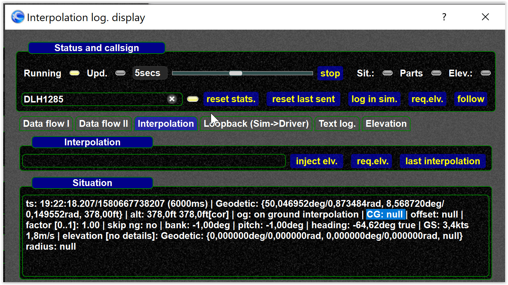

<!--
    SPDX-FileCopyrightText: Copyright (C) swift Project Community / Contributors
    SPDX-License-Identifier: GFDL-1.3-only
-->

If you see another aircraft floating or below ground, this can have multiple reasons.
It might make sense to trace the interpolation to see if *swift* "thinks" the plane should be on ground.

Upfront:

- aircraft too high or too low is caused by scenery offsets and/or missing/wrong vertical offsets (aka CG).
- typical causes may include
    - missing CG/offset
    - wrong XPlane elevation
    - missing FSX terrain probe, see [FSX probe](../home/install/fsx_p3d/install_terrain_probe.md)
    - wrong gnd. flag from other party

So checking floating/hovering means to check

1. the gnd. flag
2. the offset/CG
3. the elevation

You can debug the issue in two ways:

1. "Live" as described below, using the interpolation log. display
2. or recorded as described in [Tracing interpolation](./tracing_interpolation.md#full-html-log)

## Understanding the ground flag

- if other aircraft send aircraft parts with a ground flag or a gnd. flag we know the aircraft should be on ground
- in all other cases (no gnd. flag) we are guessing if the aircraft is supposed to be on ground.

## Starting the log. display

Use `.drv intdisplay` to launch the window.
See Interpolation log. display window for details.

## 1) Checking gnd. situation (log. display)

- select the aircraft you want to check

    {: style="width:40%"}

- you can check the input situations from the network

    {: style="width:70%"}

- unter interpolation you can see the interpolated situation for your simulator

    {: style="width:70%"}

- to refresh press

    {: style="width:30%"}

- note that the marked text says it is on ground
- you could also check the loopback situation, which is the last situation we received from the simulator for that aircraft

    {: style="width:70%"}

## 2) Checking the CG (aka vertical offset)

You can check the CG in two ways:

1. in the interpolation log. display
2. or in the "rendered" aircraft model view.

### interpolation log. display

In the interpolation tab you can see CG as it is "really" used for the interpolated situation

{: style="width:70%"}

You can also check if the simulator CG is available, which is available in the "Data flow" tab.

{: style="width:70%"}

Here you can see the CG (as stored in the DB) and if an aircraft has parts (which means a ground flag is sent on VATSIM).

### Rendered aircraft view

{: style="width:70%"}

`null` values mean the vertical offset/CG is not available.

1. do not confuse `null` and zero "0".
    `null` means value is not available, while "0" means the values is available.
2. some aircraft have 0 (zero) based offsets (so 0 can be a correct value)

    {: style="width:70%"}

3)  checking the elevation

!!! warning

    For performance reasons we do not query elevations all the time

- you can set coordinates (e.g. for your own aircraft) and test if the requested elevation is available (means the probe works)
- you can also check the elevation history and see if there are incoming elevation values.
    Again: please understand we only query elevations for aircraft supposed to be "near ground".

    {: style="width:70%"}

