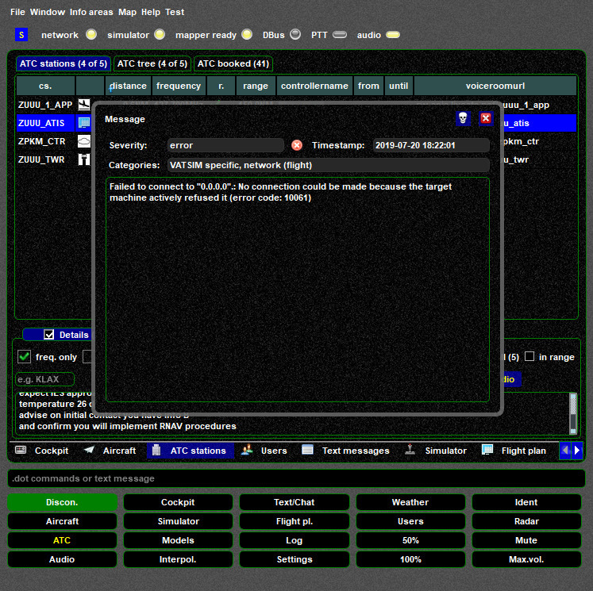

<!--
    SPDX-FileCopyrightText: Copyright (C) swift Project Community / Contributors
    SPDX-License-Identifier: GFDL-1.3-only
-->

If a connection to a single ATC station fails check if the station really supports voice control.
Some people set up a voice room but do NOT provide voice ATC.

{: style="width:70%"}

{: style="width:70%"}
