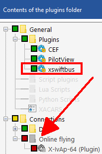
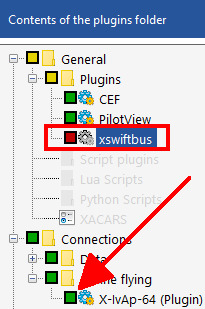

<!--
SPDX-FileCopyrightText: Copyright (C) swift Project Community / Contributors
SPDX-License-Identifier: GFDL-1.3-only
-->

As we have learned, X-Plane **plugins that deal with injecting CSL models** into the simulator **will clash with each other**.
Only **one** such plugin may be installed or activated **at a time** to avoid conflicts and erroneous rendering of CSL models.

For **Windows users** one reliable way of achieving this is using a program called **xOrganizer**.
It can do the job, because it actually renames plugins (.xpl-files) when you deactivate them, so they become "invisible" to X-Plane.
This stops X-Plane from initializing deactivated plugins at startup.
The default plugin manager of X-Plane does not prevent this from happening, it is not sufficient to truly switch off such plugins.

If you use several plugins for CSL model injection, xOrganizer may be a comfortable solution to switch between them.

XSwiftBus ON, X-IvAp OFF | XSwiftBus OFF, X-IvAp ON |
|-|-|
|  |  |

xOrganizer comes in two versions:

* **legacy freeware** v1.3.0.0 (abandoned): ([source](https://www.xflightdeck.com/))
* **actively maintained payware** v2.x: **[xOrganizer homepage](http://www.4xplane.nl/xorganizer/)** (cost about 12.50 USD)

!!! note

    xOrganizer is a 3rd party software and not related to *swift*.
    Using it is only a suggestion and if you like the freeware version of it, you may want to consider buying the current version to support further development.
