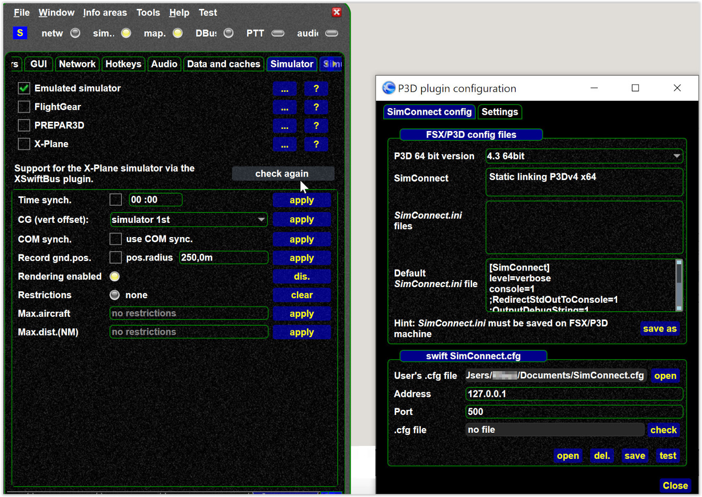
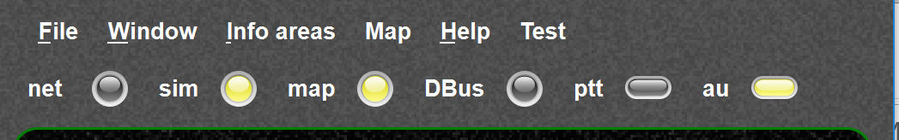

<!--
    SPDX-FileCopyrightText: Copyright (C) swift Project Community / Contributors
    SPDX-License-Identifier: GFDL-1.3-only
-->

## 1) All simulators, OS

**Checklist**

Read this [checklist](../home/checklist_first_flight.md)

**Setup / bootstrap file trouble**

See [Bootstrap file](./bootstrap.md).

***swift* does not start / connect**

- Could be a Virus scanner/Security suite issue, maybe check if swift needs some permission there
- Firewall, ports open ...
- if you see something like
    `"ASSERT failure in QList <T>::operator "index out of range", file C:\QT\5.12.0\msvc2017_64\include\ Qtcore/qlist.h,line 552"`
    your settings could be corrupt, [see here](./../documentation/flying/settings/reset_screen_size.md)
- sometimes it can help to uncheck and check again the simulator again (simulator settings)

**swift hangs after start**

- could be that the screen geometry values are incorrect, see [Reset the screen size](./../documentation/flying/settings/reset_screen_size.md)
- or even [Delete swift registry values (Windows only)](./delete_registry_values.md)
- also we had people having issues with
    - malware protection
    - recently some reports with TrueImage Active protection came up (that blocking swift)

**Validation errors**

See [Why do I see validation errors during startup?](./../documentation/flying/why_validation_errors.md)

**No Mic / cannot talk to controller**

-   [Troubleshoot voice (no ATC, no MIC, no sound, sample rates, WASAPI)](./voice.md)
-   MacOS user? See [here](./no_sound_macos.md)
-   Windows: [Microphone not working on Windows](./no_microphone_windows.md)

**The Qt WIFI problem**

If you see messages like `No network access point` or `No network` and **you are using WIFI** then you likely suffer from a Qt bug.
In some versions the Qt framework (the library *swift* uses) is broken.
Qt has promised to fix that.
However, you can try the following workaround.
In your *swift* installation directory you will see a directory `bearer`, just remove this directory and try again.

## 2) Simulator specific

**P3D/FSX specific**

- I only see "Constellations".
  Most likely you have no model set, an improper model set.
- If the simulator does NOT connect, see the configuration page for your simulator
- make sure you have the correct *swift* version, [32 bit or 64 bit](./../documentation/flying/p3d_64_or_32.md)
- If you cannot connect the simulator and *swift*: If you run P3D "as admin\", run swift "as admin"
- make sure you use the correct P3D driver version.
  If this version does not (yet) exists, selected the version which comes closest.

{: style="width:70%"}

**X-Plane specific**

- Warn of XSquawkBox/xPilot conflict
    - *xswiftbus* doesn\'t work properly if xsquawkbox or x-ivap is also installed since only one can have control of X-Plane multiplayer aircraft.
        *swift* will raise a warning in case another plugin is controlling the multiplayer aircraft.
    - Remove or disable the conflicting plugin and restart X-Plane.
      Plugins are still loaded even if they are disabled.
      Disabled just means that any callbacks registered by the plugin will not be called.
      Some people have to remove the plugins from the folder, some do not.
    - Maybe you consider a 3rd party tool like [XOrganizer](./faq/xp_landing_gear/deactivate_plugins_xorganizer.md)
- **Bluebell CSL models sunken in ground** (vertical offset fix) , see TODO
- XPlane models in model set, **but not rendered**.
    **Solution**: CSL files need to be inside the `XPlane` folder.
    Moving the XPlane models might require to reload your swift model cache, then recreating the model set.
- *swift* cannot connect to XPlane simulator side plugin:
    - Check if the settings of the *swift* side and XPlane side do match, [xswiftbus settings](./../documentation/flying/settings/xswiftbus.md).
    - If the simulator LED is "on" the simulator can be connected:

        {: style="width:70%"}

    - XPlane not connecting with *swift* on MacOS, see [this page](./xp_on_macos.md).
- **HINT:** Some users did have problems with spaces in their model directory paths
- **Aircraft animation** as gear down **not working**:
    - There are some known conflicts with other XPlane add-ons as those keep common multiplayer animation `datarefs` (being shared between all pilot clients) locked and the *swift* dataref registration fails.
    - In order to resolve the problem move the conflicting plugin out of your plugin folder and restart.
      The conflict is known to cause trouble with gear animations and such.
    - Problems with the following plugins have been reported: all other client plugins like XSB, x-ivap, fscloud, fs2play

**FS9 specific**

- FS9 needs two connections: `DirectPlay` Multiplayer and `FSUIPC` since DP MP doesn't have all required details
    - `DirectPlay` is auto connected if swift runs on the same machine and has been properly installed (adding itself as "lobby-able" application on windows registry)
    - See [this page](./connect_fs9_manually.md)

- When you run FS9 as admin, then `FSUIPC` isn't connecting, because *swift* running as non admin blocks the connection.
  Run both as admin.
- Some people have have reported issues with models not from the `aircraft` folder of FS9
-   some users have problems with the auto-connect to FS9 since Win10 1909 update, see [this page](./connect_fs9_manually.md)
-   [FS9 elevation](./../home/install/fs9/fs9_ground_elevation.md)

**3) OS specific**

**Some issues with Mac OS**

- XPlane not connecting with *swift* on MacOS, see [this page](./xp_on_macos.md).
- Not validated: Installation in `Application` failed, but in XPlane directory it works.
