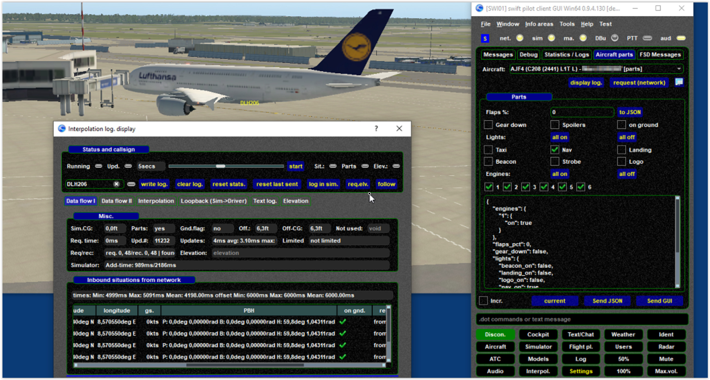
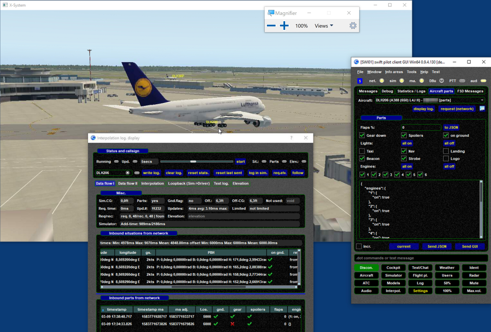
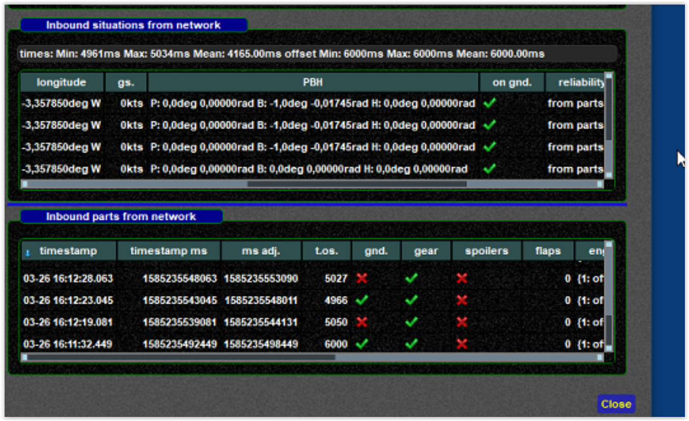

<!--
    SPDX-FileCopyrightText: Copyright (C) swift Project Community / Contributors
    SPDX-License-Identifier: GFDL-1.3-only
-->

Although the other client supports "parts", if does NOT send gear down, only "on ground".

{: style="width:70%"}

Here with manually overridden "GEAR DOWN" fron internals page ([see tracing parts](./tracing_aircraft_parts.md)).

{: style="width:70%"}

A client sending gnd on/off causing an oscillating up/down aircraft

{: style="width:70%"}
